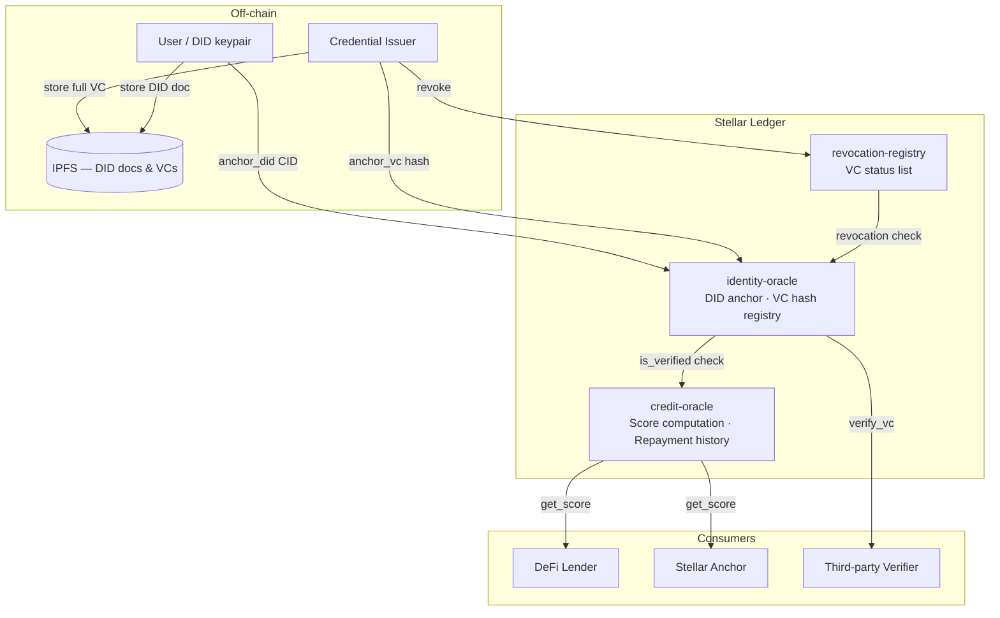

# stellar-did-credit

A decentralized identity and credit scoring protocol built on Stellar. Users own their financial identity as a cryptographic keypair, collect verifiable credentials from trusted issuers, and receive a portable credit score computed transparently on-chain — no bank account required, no central credit bureau.

**Status:** This project is in active development. See [Contributing](#contributing) to get started.

## Table of contents

- [The problem](#the-problem)
- [How it works](#how-it-works)
- [Architecture](#architecture)
- [Contracts](#contracts)
- [Deployed contracts](#deployed-contracts)
- [Scoring formula](#scoring-formula)
- [Quick start](#quick-start)
- [Running tests](#running-tests)
- [Project structure](#project-structure)
- [TypeScript SDK](#typescript-sdk)
- [Roadmap](#roadmap)
- [Security](#security)
- [Contributing](#contributing)
- [License](#license)

---

## The problem

1.4 billion people worldwide are unbanked. Hundreds of millions more are underbanked — they have access to basic accounts but cannot access credit because they have no verifiable financial history. Traditional credit bureaus require years of formal banking records. A smallholder farmer in Nigeria, a gig worker in Kenya, or a merchant in the Philippines may have a decade of reliable financial behavior with zero way to prove it to a lender.

The result: credit is either unavailable or predatory. Lenders price in maximum risk because they cannot assess individual risk. Borrowers pay the cost.

This protocol flips the model. Identity and financial history are owned by the individual, anchored on a public ledger, and verifiable by any lender without a central intermediary.

---

## How it works

The protocol has three steps:

**1. Get a decentralized identity (DID)**
A user generates a Stellar keypair. Their public key becomes their DID: `did:stellar:testnet:G...`. They publish a [DID document](docs/did-spec.md#23-complete-example-document) to IPFS and anchor its content hash to the Stellar ledger via the identity-oracle contract. No registration required — the keypair is the identity. See [DID Document Schema](docs/did-spec.md#2-did-document-schema) for the required JSON-LD structure.

**2. Collect verifiable credentials (VCs)**
Trusted issuers — KYC providers, payroll platforms, microfinance institutions, mobile money operators — sign JSON-LD credentials attesting to facts about the user (identity verified, income range, previous repayment history). The SHA-256 hash of each credential is anchored on-chain. The credential itself stays off-chain, preserving privacy.

**3. Credit score computed on-chain**
The credit-oracle Soroban contract aggregates anchored VC hashes, on-chain transaction statistics, and repayment records into a composite score from 300 to 850. Any lender, anchor, or verifier can query the score permissionlessly. The scoring weights are governed and upgradeable.

---

## Architecture



---

## Contracts

The protocol is composed of three Soroban smart contracts deployed on the Stellar network.

### identity-oracle

Manages decentralized identifiers and verifiable credential anchoring.

| Function                                    | Description                                    |
| ------------------------------------------- | ---------------------------------------------- |
| `initialize(admin)`                         | Sets the contract admin                        |
| `register_issuer(admin, issuer)`            | Adds a trusted VC issuer                       |
| `deregister_issuer(admin, issuer)`          | Revokes a trusted issuer (existing VCs persist) |
| `anchor_did(subject, did_doc_cid)`          | Stores the IPFS CID of a DID document          |
| `anchor_vc(issuer, subject, vc_hash)`       | Anchors a VC hash from a trusted issuer        |
| `is_verified(subject)`                      | Returns true if subject has ≥ 1 non-revoked VC |
| `get_vc_count(subject)`                     | Returns the number of anchored VCs             |
| `verify_vc(subject, vc_hash)`               | Checks if a specific VC hash is valid          |
| `mark_vc_revoked(issuer, subject, vc_hash)` | Marks a VC as revoked                          |
| `upgrade(admin, new_wasm_hash)`             | Upgrades the contract WASM in-place            |

### credit-oracle

Computes and stores credit scores based on on-chain data.

| Function                                             | Description                                        |
| ---------------------------------------------------- | -------------------------------------------------- |
| `initialize(admin)`                                  | Sets admin and default scoring weights (40/30/30)  |
| `register_feeder(admin, feeder)`                     | Registers a trusted transaction stats feeder       |
| `deregister_feeder(admin, feeder)`                   | Revokes a trusted feeder (no retroactive effect)   |
| `register_lender(admin, lender)`                     | Registers a trusted lender for repayment recording |
| `deregister_lender(admin, lender)`                   | Revokes a trusted lender (no retroactive effect)   |
| `update_tx_stats(feeder, subject, stats)`            | Updates 30-day transaction statistics              |
| `record_repayment(lender, subject, amount, on_time)` | Records a loan repayment outcome                   |
| `compute_score(subject)`                             | Computes and persists the credit score             |
| `get_score(subject)`                                 | Returns the latest ScoreRecord                     |
| `propose_weights(weights)`                           | Proposes new weights with 24h timelock             |
| `apply_weights()`                                    | Applies pending weights after timelock expires     |
| `get_scoring_weights()`                              | Returns current scoring weights                    |

### revocation-registry

Maintains an on-chain list of revoked credential hashes.

| Function                          | Description                                     |
| --------------------------------- | ----------------------------------------------- |
| `initialize(admin)`               | Sets the contract admin                         |
| `revoke(issuer, vc_hash)`         | Revokes a credential by hash                    |
| `batch_revoke(issuer, vc_hashes)` | Revokes multiple credentials in one transaction |
| `is_revoked(vc_hash)`             | Returns true if the credential has been revoked |
| `upgrade(admin, new_wasm_hash)`   | Upgrades the contract WASM in-place             |

---

## Deployed contracts

### Testnet

| Contract            | Address                                                    | Explorer                                                                                                          |
| ------------------- | ---------------------------------------------------------- | ----------------------------------------------------------------------------------------------------------------- |
| identity-oracle     | `CXXXXXXXXXXXXXXXXXXXXXXXXXXXXXXXXXXXXXXXXXXXXXXXXXXXXXXX` | [view](https://stellar.expert/explorer/testnet/contract/CXXXXXXXXXXXXXXXXXXXXXXXXXXXXXXXXXXXXXXXXXXXXXXXXXXXXXXX) |
| credit-oracle       | `CXXXXXXXXXXXXXXXXXXXXXXXXXXXXXXXXXXXXXXXXXXXXXXXXXXXXXXX` | [view](https://stellar.expert/explorer/testnet/contract/CXXXXXXXXXXXXXXXXXXXXXXXXXXXXXXXXXXXXXXXXXXXXXXXXXXXXXXX) |
| revocation-registry | `CXXXXXXXXXXXXXXXXXXXXXXXXXXXXXXXXXXXXXXXXXXXXXXXXXXXXXXX` | [view](https://stellar.expert/explorer/testnet/contract/CXXXXXXXXXXXXXXXXXXXXXXXXXXXXXXXXXXXXXXXXXXXXXXXXXXXXXXX) |

Full deployment record: [deployments.testnet.json](deployments.testnet.json). Run `bash scripts/deploy.sh` to deploy your own instance.

---

## Scoring formula

The credit score ranges from 300 (no history) to 850 (exceptional). It is computed from three weighted components:

```
vc_score    = min(vc_count × 20, 100)
tx_score    = min(volume_30d_stroops ÷ 100_000_000, 100)   # 1 point per XLM, cap 100
repay_score = (on_time_count × 10000 ÷ total_count) ÷ 100  # 0–100, integer division

composite   = (vc_score × vc_weight
             + tx_score × tx_weight
             + repay_score × repayment_weight) ÷ 100

final_score = clamp(300 + composite × 550 ÷ 100, 300, 850)
```

Default weights: `vc_weight = 40`, `tx_weight = 30`, `repayment_weight = 30`

**Example scores** (all arithmetic uses integer division, matching the contract):

| Profile     | VCs | 30d Volume | Repayment rate | Score |
| ----------- | --- | ---------- | -------------- | ----- |
| New user    | 0   | 0 XLM      | —              | 300   |
| Early stage | 1   | 5 XLM      | 70%            | 465   |
| Established | 2   | 20 XLM     | 85%            | 558   |
| Strong      | 3   | 50 XLM     | 95%            | 668   |
| Exceptional | 5   | 100+ XLM   | 100%           | 850   |

Full formula documentation with worked examples: [docs/scoring-spec.md](docs/scoring-spec.md)

---

## Quick start

### Prerequisites

- Rust stable — `rustup update stable`
- `stellar-cli` 21+ — `cargo install --locked stellar-cli --features opt`
- Node.js 18+ and pnpm — `npm install -g pnpm`
- A funded Stellar testnet account — `stellar keys generate --global deployer --network testnet`

### Setup

```bash
# Clone the repo
git clone https://github.com/cybermax4200/stellar-did-credit
cd stellar-did-credit

# Install TypeScript dependencies
pnpm install

# Run all tests
pnpm test
```

### Deploy to testnet

```bash
# Fund your deployer key
curl "https://friendbot.stellar.org/?addr=$(stellar keys address deployer)"

# Deploy all three contracts
bash scripts/deploy.sh
```

Contract addresses will be saved to `deployments.testnet.json`.

---

## Running tests

Run all Rust and TypeScript tests:

```bash
pnpm test
```

For individual commands:

```bash
# Run all Rust contract tests (including integration tests)
cargo test --workspace

# Run with output for debugging
cargo test --workspace -- --nocapture

# Lint Rust contracts and TypeScript
pnpm lint

# Build release binaries
pnpm build

# Run a specific contract's tests
cargo test -p identity-oracle
cargo test -p credit-oracle
cargo test -p revocation-registry

# Run integration tests only
cargo test -p integration-tests
```

All tests use Soroban's built-in testutils — no live network required.

---

## Project structure

```
stellar-did-credit/
├── contracts/
│   ├── identity-oracle/
│   │   └── src/lib.rs          # DID anchor + VC hash registry
│   ├── credit-oracle/
│   │   └── src/lib.rs          # Score computation + repayment history
│   ├── revocation-registry/
│   │   └── src/lib.rs          # VC status list
│   └── tests/
│       └── src/integration_test.rs  # Cross-contract integration tests
├── packages/
│   └── sdk/
│       └── src/index.ts        # TypeScript SDK
├── docs/
│   ├── architecture.md         # Full component breakdown
│   ├── did-spec.md             # DID method specification
│   └── scoring-spec.md         # Scoring formula + worked examples
├── scripts/
│   └── deploy.sh               # Testnet deployment script
├── Cargo.toml                  # Workspace root
├── pnpm-workspace.yaml
├── CONTRIBUTING.md
└── LICENSE                     # Apache-2.0
```

---

## TypeScript SDK

The `@stellar-did-credit/sdk` package provides a typed client for interacting with all three contracts from a TypeScript application.

```typescript
import { StellarDIDCreditSDK } from "@stellar-did-credit/sdk";

const sdk = new StellarDIDCreditSDK({
  identityOracleId: "CXXXXXXXXXXXXXXXXXXXXXXXXXXXXXXXXXXXXXXXXXXXXXXXXXXXXXXX",
  creditOracleId: "CXXXXXXXXXXXXXXXXXXXXXXXXXXXXXXXXXXXXXXXXXXXXXXXXXXXXXXX",
  revocationRegistryId:
    "CXXXXXXXXXXXXXXXXXXXXXXXXXXXXXXXXXXXXXXXXXXXXXXXXXXXXXXX",
  networkPassphrase: "Test SDF Network ; September 2015",
  rpcUrl: "https://soroban-testnet.stellar.org",
});

// Read a credit score (read-only, no fees)
const score = await sdk.getScore("G...");
console.log(score.score); // e.g. 612
```

### SDK status

| Method                           | Status         |
| -------------------------------- | -------------- |
| `getScore(address)`              | ✅ Implemented |
| `isVerified(address)`            | 🚧 Open        |
| `anchorDID(keypair, cid)`        | 🚧 Open        |
| `issueVC(issuer, subject, hash)` | 🚧 Open        |
| `verifyVC(subject, hash)`        | ✅ Implemented |
| `revokeVC(issuer, hash)`         | 📋 Planned     |

---

## Component status

| Component               | Status         | Notes                                |
| ----------------------- | -------------- | ------------------------------------ |
| identity-oracle         | ✅ Complete    | All functions implemented and tested |
| credit-oracle           | ✅ Complete    | Scoring formula live on testnet      |
| revocation-registry     | ✅ Complete    | Batch revocation supported           |
| TypeScript SDK          | 🚧 In progress | `getScore` done, rest open           |
| CLI tool                | 📋 Planned     |                                      |
| Cross-contract vc_count | 📋 Planned     |                                      |
| ZK proof layer          | 📋 Research    |                                      |
| Governance contract     | 📋 Planned     |                                      |

---

## Roadmap

**Phase 1 — Foundation (current)**
Three core contracts deployed on testnet. TypeScript SDK for score reading. Passing CI.

**Phase 2 — SDK & tooling (contributors)**
Full TypeScript SDK with DID creation, VC issuance, and revocation. CLI tool for developers.

**Phase 3 — Cross-contract integration**
credit-oracle reads `vc_count` directly from identity-oracle via cross-contract call. Score freshness enforcement.

**Phase 4 — Privacy layer**
ZK proof circuit for selective score disclosure — prove "score > 650" without revealing the exact number or underlying credentials.

**Phase 5 — Governance**
DAO contract for scoring weight upgrades. Token-weighted voting. Timelock on changes.

**Phase 6 — Mainnet**
Security audit. Mainnet deployment. Issuer onboarding program.

---

## Security

This is a financial protocol. If you find a vulnerability in the smart contracts, SDK, or any other component, **do not open a public issue**.

Report it privately via [GitHub Security Advisories](https://github.com/cybermax4200/stellar-did-credit/security/advisories/new). We acknowledge all reports within 72 hours. See [SECURITY.md](SECURITY.md) for the full disclosure policy, scope, and response SLA.

---

## Contributing

Contributions are welcome. See [CONTRIBUTING.md](CONTRIBUTING.md) for setup and guidelines.

### How to contribute

1. Browse [open issues](https://github.com/cybermax4200/stellar-did-credit/issues) — look for `good first issue` to start
2. Comment on the issue to signal you're working on it
3. **Fork** the repo on GitHub, then clone your fork: `git clone https://github.com/YOUR_USERNAME/stellar-did-credit`
4. Create a branch: `git checkout -b feat/your-feature`
5. Write your code with tests — `cargo test --workspace` must pass
6. Push to your fork and open a pull request — make sure the base repository is set to **`cybermax4200/stellar-did-credit`**, not your own fork

### Issue complexity levels

| Label     | Points  | Typical scope                                               |
| --------- | ------- | ----------------------------------------------------------- |
| `trivial` | 100 pts | Single function, clear spec, minimal context needed         |
| `medium`  | 150 pts | Multiple functions or cross-package work                    |
| `high`    | 200 pts | New contract feature, ZK work, or architecture-level change |

### Development requirements

- `cargo clippy --workspace -- -D warnings` must pass with zero warnings
- Every public contract function must have a `///` doc comment
- New functions require at least one test
- No `unwrap()` in contract logic — use `expect("descriptive message")`
- Conventional commit messages: `feat:`, `fix:`, `test:`, `docs:`, `chore:`

Full setup and guidelines: [CONTRIBUTING.md](CONTRIBUTING.md)

### Resources

- [Stellar Developer Docs](https://developers.stellar.org)
- [Soroban Smart Contracts](https://soroban.stellar.org)
- [W3C DID Specification](https://www.w3.org/TR/did-core/)
- [W3C Verifiable Credentials](https://www.w3.org/TR/vc-data-model/)
- [Stellar Laboratory](https://laboratory.stellar.org)
- [Stellar Expert (Testnet Explorer)](https://stellar.expert/explorer/testnet)
- [Project Architecture](docs/architecture.md)
- [Scoring Specification](docs/scoring-spec.md)
- [DID Method Specification](docs/did-spec.md)

---

## License

Apache License 2.0 — see [LICENSE](LICENSE) for full text.
