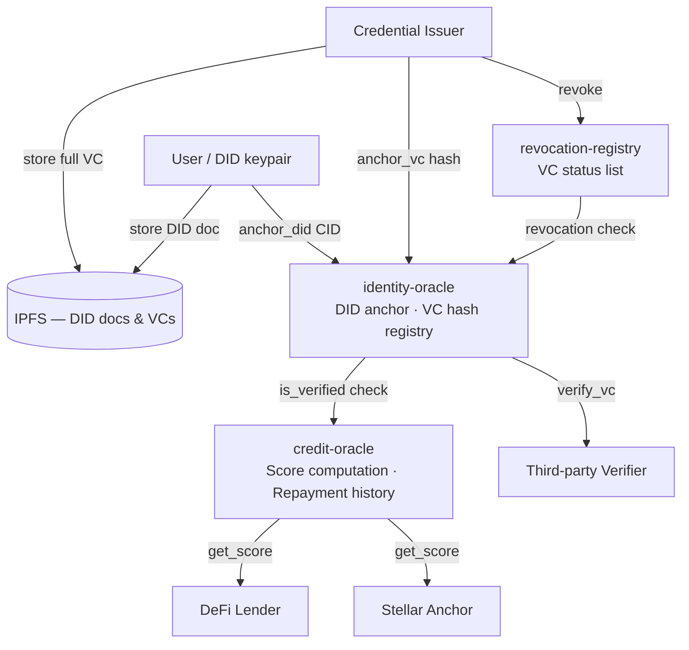

# stellar-did-credit

A decentralized identity and credit scoring protocol built on Stellar. Users own their financial identity as a cryptographic keypair, collect verifiable credentials from trusted issuers, and receive a portable credit score computed transparently on-chain — no bank account required, no central credit bureau.

**Status:** This project is in active development. See [Contributing](#contributing) to get started.

## Table of contents

- [The problem](#the-problem)
- [How it works](#how-it-works)
- [Architecture](#architecture)
- [Contracts](#contracts)
- [Deployed contracts](#deployed-contracts)
- [Scoring formula](#scoring-formula)
- [Quick start](#quick-start)
- [Running tests](#running-tests)
- [Project structure](#project-structure)
- [TypeScript SDK](#typescript-sdk)
- [Feeder](#feeder)
- [CLI](#cli)
- [Roadmap](#roadmap)
- [Security](#security)
- [Contributing](#contributing)
- [License](#license)

---

## The problem

1.4 billion people worldwide are unbanked. Hundreds of millions more are underbanked — they have access to basic accounts but cannot access credit because they have no verifiable financial history. Traditional credit bureaus require years of formal banking records. A smallholder farmer in Nigeria, a gig worker in Kenya, or a merchant in the Philippines may have a decade of reliable financial behavior with zero way to prove it to a lender.

The result: credit is either unavailable or predatory. Lenders price in maximum risk because they cannot assess individual risk. Borrowers pay the cost.

This protocol flips the model. Identity and financial history are owned by the individual, anchored on a public ledger, and verifiable by any lender without a central intermediary.

---

## How it works

The protocol has three steps:

**1. Get a decentralized identity (DID)**
A user generates a Stellar keypair. Their public key becomes their DID: `did:stellar:testnet:G...`. They publish a [DID document](docs/did-spec.md#23-complete-example-document) to IPFS and anchor its content hash to the Stellar ledger via the identity-oracle contract. No registration required — the keypair is the identity. See [DID Document Schema](docs/did-spec.md#2-did-document-schema) for the required JSON-LD structure.

**2. Collect verifiable credentials (VCs)**
Trusted issuers — KYC providers, payroll platforms, microfinance institutions, mobile money operators — sign JSON-LD credentials attesting to facts about the user (identity verified, income range, previous repayment history). The SHA-256 hash of each credential is anchored on-chain. The credential itself stays off-chain, preserving privacy. See the [Issuer Integration Guide](docs/issuer-guide.md) for the full VC format, hashing process, and a working Node.js example.

**3. Credit score computed on-chain**
The credit-oracle Soroban contract aggregates anchored VC hashes, on-chain transaction statistics, and repayment records into a composite score from 300 to 850. Any lender, anchor, or verifier can query the score permissionlessly. The scoring weights are governed via the on-chain governance contract (see [docs/governance.md](docs/governance.md)) and upgradeable through a double-timelock flow.

---

## Architecture


```mermaid
graph TB
    OFF_USER[User / DID keypair]
    OFF_ISSUER[Credential Issuer]
    OFF_IPFS[(IPFS — DID docs & VCs)]

    SC_IO[identity-oracle\nDID anchor · VC hash registry]
    SC_CO[credit-oracle\nScore computation · Repayment history]
    SC_RR[revocation-registry\nVC status list]

    CON_LENDER[DeFi Lender]
    CON_ANCHOR[Stellar Anchor]
    CON_VERIFIER[Third-party Verifier]

    OFF_USER    -->|anchor_did CID| SC_IO
    OFF_ISSUER  -->|anchor_vc hash| SC_IO
    OFF_ISSUER  -->|store full VC| OFF_IPFS
    OFF_USER    -->|store DID doc| OFF_IPFS
    SC_IO       -->|is_verified check| SC_CO
    SC_RR       -->|revocation check| SC_IO
    OFF_ISSUER  -->|revoke| SC_RR
    SC_CO       -->|get_score| CON_LENDER
    SC_CO       -->|get_score| CON_ANCHOR
    SC_IO       -->|verify_vc| CON_VERIFIER
```

---

## Contracts

The protocol is composed of four Soroban smart contracts deployed on the Stellar network.

### identity-oracle

Manages decentralized identifiers and verifiable credential anchoring.

| Function                                    | Description                                     |
| ------------------------------------------- | ----------------------------------------------- |
| `initialize(admin)`                         | Sets the contract admin                         |
| `register_issuer(admin, issuer)`            | Adds a trusted VC issuer                        |
| `deregister_issuer(admin, issuer)`          | Revokes a trusted issuer (existing VCs persist) |
| `anchor_did(subject, did_doc_cid)`          | Stores the IPFS CID of a DID document           |
| `anchor_vc(issuer, subject, vc_hash)`       | Anchors a VC hash from a trusted issuer         |
| `is_verified(subject)`                      | Returns true if subject has ≥ 1 non-revoked VC  |
| `get_vc_count(subject)`                     | Returns the number of anchored VCs              |
| `verify_vc(subject, vc_hash)`               | Checks if a specific VC hash is valid           |
| `mark_vc_revoked(issuer, subject, vc_hash)` | Marks a VC as revoked                           |
| `upgrade(admin, new_wasm_hash)`             | Upgrades the contract WASM in-place             |

### credit-oracle

Computes and stores credit scores based on on-chain data.

| Function                                             | Description                                        |
| ---------------------------------------------------- | -------------------------------------------------- |
| `initialize(admin)`                                  | Sets admin and default scoring weights (40/30/30)  |
| `register_feeder(admin, feeder)`                     | Registers a trusted transaction stats feeder       |
| `deregister_feeder(admin, feeder)`                   | Revokes a trusted feeder (no retroactive effect)   |
| `register_lender(admin, lender)`                     | Registers a trusted lender for repayment recording |
| `deregister_lender(admin, lender)`                   | Revokes a trusted lender (no retroactive effect)   |
| `update_tx_stats(feeder, subject, stats)`            | Updates 30-day transaction statistics              |
| `record_repayment(lender, subject, amount, on_time)` | Records a loan repayment outcome                   |
| `compute_score(subject)`                             | Computes and persists the credit score             |
| `get_score(subject)`                                 | Returns the latest ScoreRecord                     |
| `propose_weights(weights)`                           | Proposes new weights with 24h timelock             |
| `apply_weights()`                                    | Applies pending weights after timelock expires     |
| `get_scoring_weights()`                              | Returns current scoring weights                    |

### governance

On-chain proposal creation, weighted voting, and multi-step execution for updating credit-oracle scoring weights. Voting power is assigned by the contract admin (admin-registered voters, not token-weighted). Full documentation: [docs/governance.md](docs/governance.md).

| Function                                                     | Description                                              |
| ------------------------------------------------------------ | -------------------------------------------------------- |
| `initialize(admin, credit_oracle, quorum_required)`          | Sets admin, oracle address, and default quorum           |
| `accept_oracle_admin()`                                       | Accepts credit-oracle admin role (two-step transfer)     |
| `create_proposal(proposer, weights, voting_period, delay)`   | Creates a weight-update proposal; returns proposal ID    |
| `vote(voter, proposal_id, vote_for, vote_weight)`            | Casts a weighted vote on an open proposal                |
| `execute(proposal_id)`                                        | After expiry + delay, queues weights in credit-oracle    |
| `apply_weights()`                                             | Finalizes queued weights after credit-oracle timelock    |
| `register_voter(admin, voter, weight)`                       | Admin registers a voter with a weight                    |
| `update_voter_weight(admin, voter, weight)`                  | Admin updates or deregisters a voter (weight = 0)        |
| `set_quorum(admin, quorum_required)`                         | Admin sets the default quorum for future proposals       |
| `get_proposal(proposal_id)`                                  | Returns a proposal by ID                                 |
| `cancel(canceller, proposal_id, reason)`                     | Emits a cancellation event (stub — no on-chain effect)   |

### revocation-registry

Maintains an on-chain list of revoked credential hashes.

| Function                          | Description                                     |
| --------------------------------- | ----------------------------------------------- |
| `initialize(admin)`               | Sets the contract admin                         |
| `revoke(issuer, vc_hash)`         | Revokes a credential by hash                    |
| `batch_revoke(issuer, vc_hashes)` | Revokes multiple credentials in one transaction |
| `is_revoked(vc_hash)`             | Returns true if the credential has been revoked |
| `upgrade(admin, new_wasm_hash)`   | Upgrades the contract WASM in-place             |

---

## Deployed contracts

### Testnet

| Contract            | Address                                                    | Explorer                                                                                                          |
| ------------------- | ---------------------------------------------------------- | ----------------------------------------------------------------------------------------------------------------- |
| identity-oracle     | `CXXXXXXXXXXXXXXXXXXXXXXXXXXXXXXXXXXXXXXXXXXXXXXXXXXXXXXX` | [view](https://stellar.expert/explorer/testnet/contract/CXXXXXXXXXXXXXXXXXXXXXXXXXXXXXXXXXXXXXXXXXXXXXXXXXXXXXXX) |
| credit-oracle       | `CXXXXXXXXXXXXXXXXXXXXXXXXXXXXXXXXXXXXXXXXXXXXXXXXXXXXXXX` | [view](https://stellar.expert/explorer/testnet/contract/CXXXXXXXXXXXXXXXXXXXXXXXXXXXXXXXXXXXXXXXXXXXXXXXXXXXXXXX) |
| revocation-registry | `CXXXXXXXXXXXXXXXXXXXXXXXXXXXXXXXXXXXXXXXXXXXXXXXXXXXXXXX` | [view](https://stellar.expert/explorer/testnet/contract/CXXXXXXXXXXXXXXXXXXXXXXXXXXXXXXXXXXXXXXXXXXXXXXXXXXXXXXX) |

Full deployment record: [deployments.testnet.json](deployments.testnet.json). Run `bash scripts/deploy.sh` to deploy your own instance.

---

## Scoring formula

The credit score ranges from 300 (no history) to 850 (exceptional). It is computed from three weighted components:

```
vc_score    = min(vc_count × 20, 100)
tx_score    = min(volume_30d_stroops ÷ 100_000_000, 100)   # 1 point per XLM, cap 100
repay_score = (on_time_count × 10000 ÷ total_count) ÷ 100  # 0–100, integer division

composite   = (vc_score × vc_weight
             + tx_score × tx_weight
             + repay_score × repayment_weight) ÷ 100

final_score = clamp(300 + composite × 550 ÷ 100, 300, 850)
```

Default weights: `vc_weight = 40`, `tx_weight = 30`, `repayment_weight = 30`

**Example scores** (all arithmetic uses integer division, matching the contract):

| Profile     | VCs | 30d Volume | Repayment rate | Score |
| ----------- | --- | ---------- | -------------- | ----- |
| New user    | 0   | 0 XLM      | —              | 300   |
| Early stage | 1   | 5 XLM      | 70%            | 465   |
| Established | 2   | 20 XLM     | 85%            | 558   |
| Strong      | 3   | 50 XLM     | 95%            | 668   |
| Exceptional | 5   | 100+ XLM   | 100%           | 850   |

Full formula documentation with worked examples: [docs/scoring-spec.md](docs/scoring-spec.md)

---

## Quick start

### Prerequisites

- Rust stable — `rustup update stable`
- `stellar-cli` 21+ — `cargo install --locked stellar-cli --features opt`
- Node.js 18+ and pnpm — `npm install -g pnpm`
- A funded Stellar testnet account — `stellar keys generate --global deployer --network testnet`

### Setup

```bash
# Clone the repo
git clone https://github.com/cybermax4200/stellar-did-credit
cd stellar-did-credit

# Install TypeScript dependencies
pnpm install

# Run all tests
pnpm test
```

### Deploy to testnet

```bash
# Fund your deployer key and deploy all three contracts in one step
bash scripts/deploy.sh --fund
```

If the deployer account is already funded, the script will skip the Friendbot step and proceed directly to deployment.

Contract addresses will be saved to `deployments.testnet.json`.

---

## Running tests

Run all Rust and TypeScript tests:

```bash
pnpm test
```

For individual commands:

```bash
# Run all Rust contract tests (including integration tests)
cargo test --workspace

# Run with output for debugging
cargo test --workspace -- --nocapture

# Lint Rust contracts and TypeScript
pnpm lint

# Build release binaries
pnpm build

# Run a specific contract's tests
cargo test -p identity-oracle
cargo test -p credit-oracle
cargo test -p revocation-registry
cargo test -p governance

# Run integration tests only
cargo test -p integration-tests
```

All tests use Soroban's built-in testutils — no live network required.

---

## Project structure

```
stellar-did-credit/
├── contracts/
│   ├── identity-oracle/
│   │   └── src/lib.rs          # DID anchor + VC hash registry
│   ├── credit-oracle/
│   │   └── src/lib.rs          # Score computation + repayment history
│   ├── revocation-registry/
│   │   └── src/lib.rs          # VC status list
│   ├── governance/
│   │   └── src/lib.rs          # On-chain proposals + voting for weight updates
│   └── tests/
│       └── src/integration_test.rs  # Cross-contract integration tests
├── packages/
│   ├── sdk/
│   │   └── src/index.ts        # TypeScript SDK
│   ├── issuer-example/
│   │   └── src/issue.ts        # Minimal issuer script (hash + anchor a VC)
│   └── feeder/
│       └── src/index.ts        # Reference feeder (syncs Horizon stats + VC count to credit-oracle)
├── docs/
│   ├── architecture.md         # Full component breakdown
│   ├── did-spec.md             # DID method specification
│   ├── governance.md           # Governance contract: reference, integration, security
│   ├── epoch-model.md          # TTL management, compute cooldown, weight timelock
│   ├── issuer-guide.md         # Issuer integration guide (VC format, hashing, key management)
│   ├── scoring-spec.md         # Scoring formula + worked examples
│   └── zk-proof-design.md      # Phase 4 ZK selective disclosure design
├── scripts/
│   └── deploy.sh               # Testnet deployment script
├── Cargo.toml                  # Workspace root
├── pnpm-workspace.yaml
├── CONTRIBUTING.md
└── LICENSE                     # Apache-2.0
```

---

## TypeScript SDK

The `@stellar-did-credit/sdk` package provides a typed client for interacting with the core protocol contracts from a TypeScript application. Configure `governanceId` to use the proposal, voting, execution, and weight-application helpers through `sdk.governance`.

````typescript
import { StellarDIDCreditSDK } from "@stellar-did-credit/sdk";

const sdk = new StellarDIDCreditSDK({
  identityOracleId: "CXXXXXXXXXXXXXXXXXXXXXXXXXXXXXXXXXXXXXXXXXXXXXXXXXXXXXXX",
  creditOracleId: "CXXXXXXXXXXXXXXXXXXXXXXXXXXXXXXXXXXXXXXXXXXXXXXXXXXXXXXX",
  revocationRegistryId:
    "CXXXXXXXXXXXXXXXXXXXXXXXXXXXXXXXXXXXXXXXXXXXXXXXXXXXXXXX",
  networkPassphrase: "Test SDF Network ; September 2015",
  rpcUrl: "https://soroban-testnet.stellar.org",
});

// Read a credit score (read-only, no fees)
const score = await sdk.getScore("G...");

if (score) {
  console.log(score.score); // e.g. 612
} else {
  console.log("No credit score has been computed for this subject yet.");
}

> **Note:** `sdk.getScore()` returns `null` if a score has not yet been computed for the subject. Always check for `null` before accessing properties on the returned value.

### SDK status

| Method                           | Status         |
| -------------------------------- | -------------- |
| `getScore(address)`              | ✅ Implemented |
| `isVerified(address)`            | ✅ Implemented |
| `anchorDID(keypair, cid)`        | 🚧 Open        |
| `issueVC(issuer, subject, hash)` | 🚧 Open        |
| `verifyVC(subject, hash)`        | ✅ Implemented |
| `revokeVC(issuer, hash)`         | ✅ Implemented |

---

## Feeder

The `@stellar-did-credit/feeder` package is a reference implementation of the trusted feeder role required by the credit-oracle contract.

A feeder is a registered off-chain service that periodically calls two credit-oracle entrypoints:

| Call | What it does |
| ---- | ------------ |
| `set_vc_count(feeder, subject, count)` | **Deprecated**: Caches the active VC count. Use cross-contract lookup via `set_identity_oracle` instead. |
| `update_tx_stats(feeder, subject, stats)` | Pushes 30-day Horizon payment stats (volume, tx count, counterparties) |

### Migration path for set_vc_count deprecation

The `set_vc_count` function is deprecated in favor of cross-contract VC count lookup via the identity-oracle. When the credit-oracle has an identity-oracle configured via `set_identity_oracle`, the feeder will automatically skip `set_vc_count` calls and a deprecation warning event (`VcCntDep`) will be emitted if the function is still called.

#### For feeder operators:

1. **No immediate action required** — The feeder automatically detects when cross-contract lookup is configured and skips `set_vc_count` calls.

2. **Optional explicit configuration** — Add `skipLegacyVcCount: true` to your `FeederConfig` to explicitly disable `set_vc_count` calls regardless of identity-oracle configuration:

```typescript
const config: FeederConfig = {
  // ... other config
  skipLegacyVcCount: true,  // Explicitly skip set_vc_count calls
};
```

3. **Monitor deprecation events** — Watch for `VcCntDep` events if you're still calling `set_vc_count` on an oracle with identity-oracle configured. These indicate redundant calls that should be eliminated.

#### For credit-oracle operators:

1. **Phase 1** — Deploy and configure identity-oracle via `set_identity_oracle`
2. **Phase 2** — Feeders automatically stop calling `set_vc_count`  
3. **Phase 3** — Future contract version will remove `set_vc_count` entirely

The migration is backward-compatible — existing feeders continue to work without modification.

### Prerequisites

1. **Register the feeder on-chain** — the credit-oracle admin must call `register_feeder(admin, FEEDER_PUBLIC_KEY)` once before the feeder can submit data.
2. **Fund the feeder account** — the feeder keypair must hold enough XLM to pay transaction fees.

### Setup

```bash
cd packages/feeder
cp .env.example .env
# Edit .env: set FEEDER_SECRET, SUBJECTS, CREDIT_ORACLE_ID, IDENTITY_ORACLE_ID
pnpm install
````

### Run

```bash
FEEDER_SECRET=YOUR_STELLAR_SECRET_KEY \
SUBJECTS=GSUBJECT1...,GSUBJECT2... \
CREDIT_ORACLE_ID=C... \
IDENTITY_ORACLE_ID=C... \
npm start
```

The feeder runs one full cycle immediately on startup, then repeats every `POLL_INTERVAL_MS` milliseconds (default: 1 hour). Each cycle logs the fetched values and both transaction hashes.

### Use as a library

```typescript
import { Feeder, FeederConfig } from "@stellar-did-credit/feeder";
import { Keypair } from "@stellar/stellar-sdk";

const config: FeederConfig = {
  rpcUrl: "https://soroban-testnet.stellar.org",
  horizonUrl: "https://horizon-testnet.stellar.org",
  networkPassphrase: "Test SDF Network ; September 2015",
  creditOracleId: "C...",
  identityOracleId: "C...",
  simAccount: "G...",
  subjects: ["GSUBJECT..."],
  pollIntervalMs: 3_600_000,
};

const feeder = new Feeder(
  config,
  Keypair.fromSecret("YOUR_STELLAR_SECRET_KEY"),
);
const stop = feeder.start(); // begins polling; call stop() to halt
```

You can also drive individual steps:

```typescript
// Feed a single subject without the polling loop
await feeder.feedSubject("GSUBJECT...");

// Or run one cycle across all subjects
await feeder.runCycle();
```

---

## Component status

| Component               | Status         | Notes                                |
| ----------------------- | -------------- | ------------------------------------ |
| identity-oracle         | ✅ Complete    | All functions implemented and tested |
| credit-oracle           | ✅ Complete    | Scoring formula live on testnet      |
| revocation-registry     | ✅ Complete    | Batch revocation supported           |
| TypeScript SDK          | 🚧 In progress | `getScore` done, rest open           |
| Feeder                  | ✅ Complete    | Reference impl in `packages/feeder`  |
| CLI tool                | ✅ Complete    | `packages/cli`                       |
| Cross-contract vc_count | 📋 Planned     |                                      |
| ZK proof layer          | 📋 Research    |                                      |
| Governance contract     | 📋 Planned     |                                      |
| Component               | Status         | Notes                                                                |
| ----------------------- | -------------- | -------------------------------------------------------------------- |
| identity-oracle         | ✅ Complete    | All functions implemented and tested                                 |
| credit-oracle           | ✅ Complete    | Scoring formula live on testnet                                      |
| revocation-registry     | ✅ Complete    | Batch revocation supported                                           |
| governance              | ✅ Complete    | Admin-registered voter weights, double timelock, see [docs/governance.md](docs/governance.md) |
| TypeScript SDK          | 🚧 In progress | Core identity, credit, revocation, and governance helpers available |
| Feeder                  | ✅ Complete    | Reference impl in `packages/feeder`                                  |
| CLI tool                | 📋 Planned     |                                                                      |
| Cross-contract vc_count | 📋 Planned     |                                                                      |
| ZK proof layer          | 📋 Research    |                                                                      |
| Token-weighted DAO vote | 📋 Planned     | Current governance uses admin-assigned weights; token model is future |

---

---

## CLI

The `@stellar-did-credit/cli` package provides a command-line interface for interacting with the protocol contracts directly from your terminal.

### Installation

```bash
# From the repo root
pnpm install

# Run via ts-node
cd packages/cli
npx ts-node src/index.ts --help
```

Or add a shell alias for convenience:

```bash
alias stellar-did="npx ts-node $(pwd)/packages/cli/src/index.ts"
```

### Configuration

Contract IDs are loaded from (in order of precedence):

1. **Environment variables** (highest priority)
2. **Config file** — `stellar-did-config.json` or `.stellar-did-rc.json` in the current working directory or `$HOME`
3. **Built-in defaults** — Stellar testnet

#### Environment variables

| Variable                 | Description                              |
| ------------------------ | ---------------------------------------- |
| `IDENTITY_ORACLE_ID`     | identity-oracle contract address         |
| `CREDIT_ORACLE_ID`       | credit-oracle contract address           |
| `REVOCATION_REGISTRY_ID` | revocation-registry contract address     |
| `GOVERNANCE_ID`          | governance contract address              |
| `NETWORK_PASSPHRASE`     | Stellar network passphrase (default: testnet) |
| `RPC_URL`                | Soroban RPC endpoint (default: testnet)  |
| `SIM_ACCOUNT`            | Funded account for read-only simulations |

#### Config file

Create a `stellar-did-config.json` file:

```json
{
  "identityOracleId": "C...",
  "creditOracleId": "C...",
  "revocationRegistryId": "C...",
  "governanceId": "C...",
  "networkPassphrase": "Test SDF Network ; September 2015",
  "rpcUrl": "https://soroban-testnet.stellar.org"
}
```

You can also use a `deployments.testnet.json`-style file with a `contracts` block:

```json
{
  "contracts": {
    "identity-oracle": "C...",
    "credit-oracle": "C...",
    "revocation-registry": "C...",
    "governance": "C..."
  }
}
```

### Commands

#### `anchor-did` — Anchor a DID document

Stores the IPFS CID of a DID document on-chain in the identity-oracle contract.

```bash
stellar-did anchor-did <subject-secret> <did-doc-cid>

# Example
stellar-did anchor-did YOUR_STELLAR_SECRET_KEY QmExampleCid123
```

**Output:**
```
Anchoring DID for GXXXXXXXXXXXXXXXXXXXXXXXXXXXXXXXXXXXXXXXXXXXXXXXXXXXXXXXXXXXXX...
  DID Doc CID: QmExampleCid123

Success!
  Transaction: abc123def456...
  Explorer:    https://stellar.expert/explorer/testnet/tx/abc123def456...
```

#### `anchor-vc` — Anchor a Verifiable Credential

Anchors a verifiable credential hash on-chain. Must be executed by a registered trusted issuer.

```bash
stellar-did anchor-vc <issuer-secret> <subject-address> <vc-hash> [--type <type>]

# Example
stellar-did anchor-vc YOUR_STELLAR_SECRET_KEY GXXXXXXXXXXXXXXXXXXXXXXXXXXXXXXXXXXXXXXXXXXXXXXXXXXXXXXXXXXXXX a1b2c3d4e5f6a1b2c3d4e5f6a1b2c3d4e5f6a1b2c3d4e5f6a1b2c3d4e5f6a1b2 --type kyc
```

**Output:**
```
Anchoring VC for GXXXXXXXXXXXXXXXXXXXXXXXXXXXXXXXXXXXXXXXXXXXXXXXXXXXXXXXXXXXXX on testnet...
  Issuer:  GYYYYYYYYYYYYYYYYYYYYYYYYYYYYYYYYYYYYYYYYYYYYYYYYYYYYYYY
  VC Hash: a1b2c3d4e5f6a1b2c3d4e5f6a1b2c3d4e5f6a1b2c3d4e5f6a1b2c3d4e5f6a1b2
  Type:    kyc

Success!
  Transaction: abc123def456...
  Explorer:    https://stellar.expert/explorer/testnet/tx/abc123def456...
```

#### `get-score` — Fetch a credit score

Reads the on-chain credit score for a subject address (read-only, no fees).

```bash
stellar-did get-score <subject-address>

# Example
stellar-did get-score GXXXXXXXXXXXXXXXXXXXXXXXXXXXXXXXXXXXXXXXXXXXXXXXXXXXXXXXXXXXXX

# JSON output
stellar-did get-score --json GXXXXXXXXXXXXXXXXXXXXXXXXXXXXXXXXXXXXXXXXXXXXXXXXXXXXXXXXXXXXX
```

**Output:**
```
Fetching credit score for GXXXXXXXXXXXXXXXXXXXXXXXXXXXXXXXXXXXXXXXXXXXXXXXXXXXXXXXXXXXXX...

┌─────────────────────────────────────┐
│  Credit Score: 612                  │
├─────────────────────────────────────┤
│  VC Count:                       3  │
│  Repayment Rate:            8000 bps│
│  TX Volume (30d):    1000.0000000 XLM│
│  Previous Score:               558  │
│  Computed at Ledger:       1234567  │
│  Last Updated:      2026-07-01T00...│
│  Stale:                      false  │
└─────────────────────────────────────┘
```

#### `verify-vc` — Verify a credential

Checks whether a specific verifiable credential hash is valid and non-revoked on-chain (read-only, no fees).

```bash
stellar-did verify-vc <subject-address> <vc-hash>

# Example
stellar-did verify-vc GXXXXXXXXXXXXXXXXXXXXXXXXXXXXXXXXXXXXXXXXXXXXXXXXXXXXXXXXXXXXX a1b2c3d4e5f6a1b2c3d4e5f6a1b2c3d4e5f6a1b2c3d4e5f6a1b2c3d4e5f6a1b2
```

**Output:**
```
Verifying VC for GXXXXXXXXXXXXXXXXXXXXXXXXXXXXXXXXXXXXXXXXXXXXXXXXXXXXXXXXXXXXX...
  VC Hash: a1b2c3d4...

✅ VC is VALID and non-revoked on-chain.
```

#### `is-verified` — Check verification status

Checks whether a subject has at least one active, non-revoked verifiable credential (read-only, no fees).

```bash
stellar-did is-verified <subject-address>

# Example
stellar-did is-verified GXXXXXXXXXXXXXXXXXXXXXXXXXXXXXXXXXXXXXXXXXXXXXXXXXXXXXXXXXXXXX
```

#### `vc-count` — Count active credentials

Returns the number of active (non-revoked) verifiable credentials for a subject (read-only, no fees).

```bash
stellar-did vc-count <subject-address>
```

#### `vcs` — List credential anchors

Lists every verifiable credential anchor for a subject, including revoked entries (read-only, no fees).

```bash
stellar-did vcs <subject-address>
```

#### `credential-type` — Fetch a credential type label

Returns the credential type label anchored for a subject's VC hash (e.g. `kyc`, `employment`). Untyped credentials report `generic` (read-only, no fees).

```bash
stellar-did credential-type <subject-address> <vc-hash>

# Example
stellar-did credential-type GXXXXXXXXXXXXXXXXXXXXXXXXXXXXXXXXXXXXXXXXXXXXXXXXXXXXXXXXXXXXX a1b2c3d4e5f6a1b2c3d4e5f6a1b2c3d4e5f6a1b2c3d4e5f6a1b2c3d4e5f6a1b2
```

#### `did-doc` — Fetch a DID document CID

Returns the IPFS CID of the DID document anchored for a subject (read-only, no fees).

```bash
stellar-did did-doc <subject-address>
```

#### `issuers` — List trusted issuers

Lists all currently registered trusted credential issuers (read-only, no fees).

```bash
stellar-did issuers
```

#### `weights` — Show scoring weights

Fetches the current scoring weights (VC, transaction, repayment) configured on the credit-oracle contract (read-only, no fees).

```bash
stellar-did weights
```

#### `compute-score` — Compute a credit score

Submits a transaction to compute and persist a credit score on-chain. Requires a funded keypair to pay transaction fees.

```bash
stellar-did compute-score <payer-secret> <subject-address>

# Example
stellar-did compute-score YOUR_STELLAR_SECRET_KEY GXXXXXXXXXXXXXXXXXXXXXXXXXXXXXXXXXXXXXXXXXXXXXXXXXXXXXXXXXXXXX

# JSON output
stellar-did compute-score --json YOUR_STELLAR_SECRET_KEY G...
```

**Output:** (same format as `get-score`)

#### `governance` — Protocol Governance

Provides subcommands to create proposals, vote, execute, and apply weight changes. Requires `GOVERNANCE_ID` to be configured.

**Create a proposal**
```bash
stellar-did governance create-proposal <proposer-secret> <vc-weight> <tx-weight> <repay-weight> [--voting-period <ledgers>] [--delay <ledgers>]

# Example
stellar-did governance create-proposal YOUR_STELLAR_SECRET_KEY 40 30 30
```

**Vote on a proposal**
```bash
stellar-did governance vote <voter-secret> <proposal-id> <for|against> <weight>

# Example
stellar-did governance vote YOUR_STELLAR_SECRET_KEY 1 for 100
```

**Execute a proposal**
Queues a passing proposal's weights in the credit-oracle.
```bash
stellar-did governance execute <payer-secret> <proposal-id>
```

**Apply weights**
Applies queued weights after the credit-oracle timelock expires (~24 hours).
```bash
stellar-did governance apply-weights <payer-secret>
```

**Show a proposal**
```bash
stellar-did governance show <proposal-id>

# Example
stellar-did governance show 1
```

**List proposals**
```bash
stellar-did governance list [--from <id>] [--limit <n>]
```

---

## Roadmap

**Phase 1 — Foundation (current)**
Four core contracts deployed on testnet. Governance contract live with admin-registered voters. TypeScript SDK for score reading. Passing CI.

**Phase 2 — SDK & tooling (contributors)**
Full TypeScript SDK with DID creation, VC issuance, revocation, and governance client helpers. CLI tool for developers.

**Phase 3 — Cross-contract integration**
credit-oracle reads `vc_count` directly from identity-oracle via cross-contract call. Score freshness enforcement.

**Phase 4 — Privacy layer**
ZK proof circuit for selective score disclosure — prove "score > 650" without revealing the exact number or underlying credentials. Design document: [docs/zk-proof-design.md](docs/zk-proof-design.md).

**Phase 5 — Tokenized governance (future)**
Token-weighted voting (SEP-41), stake delegation, and full DAO tooling. Replaces the current admin-registered voter model.

**Phase 6 — Mainnet**
Security audit. Mainnet deployment. Issuer onboarding program.

---

## Security

This is a financial protocol. If you find a vulnerability in the smart contracts, SDK, or any other component, **do not open a public issue**.

Report it privately via [GitHub Security Advisories](https://github.com/cybermax4200/stellar-did-credit/security/advisories/new). We acknowledge all reports within 72 hours. See [SECURITY.md](SECURITY.md) for the full disclosure policy, scope, and response SLA.

---

## Contributing

Contributions are welcome. See [CONTRIBUTING.md](CONTRIBUTING.md) for setup and guidelines.

### How to contribute

1. Browse [open issues](https://github.com/cybermax4200/stellar-did-credit/issues) — look for `good first issue` to start
2. Comment on the issue to signal you're working on it
3. **Fork** the repo on GitHub, then clone your fork: `git clone https://github.com/YOUR_USERNAME/stellar-did-credit`
4. Create a branch: `git checkout -b feat/your-feature`
5. Write your code with tests — `cargo test --workspace` must pass
6. Push to your fork and open a pull request — make sure the base repository is set to **`cybermax4200/stellar-did-credit`**, not your own fork

### Development requirements

- `cargo clippy --workspace -- -D warnings` must pass with zero warnings
- Every public contract function must have a `///` doc comment
- New functions require at least one test
- No `unwrap()` in contract logic — use `expect("descriptive message")`
- Conventional commit messages: `feat:`, `fix:`, `test:`, `docs:`, `chore:`

Full setup and guidelines: [CONTRIBUTING.md](CONTRIBUTING.md)

### Resources

- [Stellar Developer Docs](https://developers.stellar.org)
- [Soroban Smart Contracts](https://soroban.stellar.org)
- [W3C DID Specification](https://www.w3.org/TR/did-core/)
- [W3C Verifiable Credentials](https://www.w3.org/TR/vc-data-model/)
- [Stellar Laboratory](https://laboratory.stellar.org)
- [Stellar Expert (Testnet Explorer)](https://stellar.expert/explorer/testnet)
- [Project Architecture](docs/architecture.md)
- [Governance Contract Reference](docs/governance.md)
- [Scoring Specification](docs/scoring-spec.md)
- [Epoch Model (TTL, cooldown, timelock)](docs/epoch-model.md)
- [DID Method Specification](docs/did-spec.md)
- [Issuer Integration Guide](docs/issuer-guide.md)
- [ZK Proof Layer Design (Phase 4)](docs/zk-proof-design.md)

---

## License

Apache License 2.0 — see [LICENSE](LICENSE) for full text.
