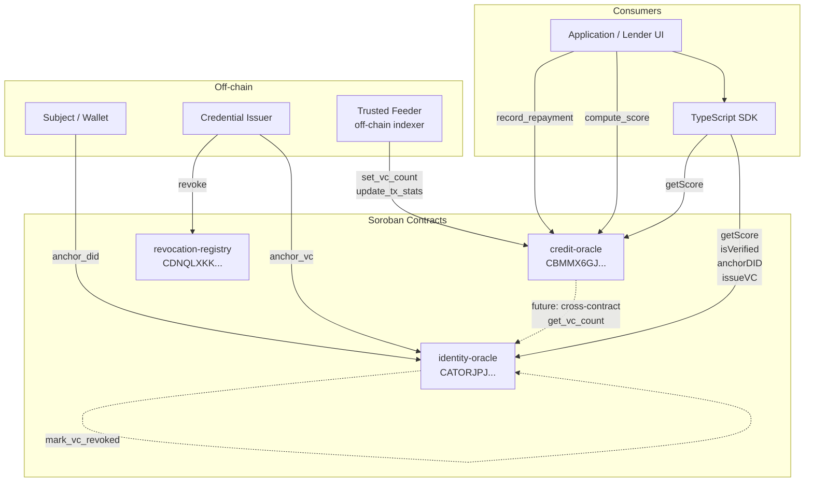
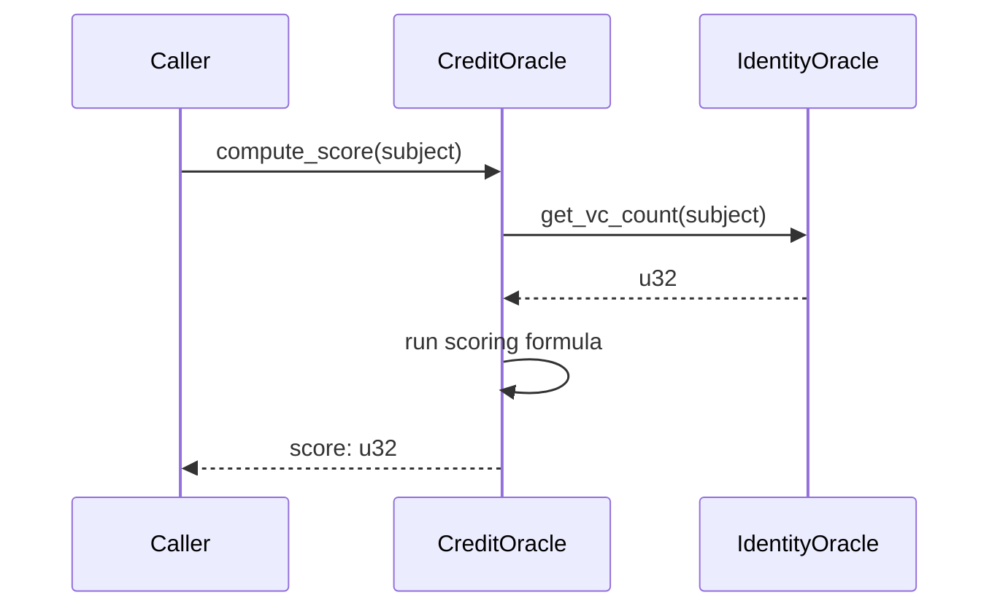

# Architecture Overview

stellar-did-credit is a three-contract protocol on Stellar/Soroban that lets any wallet address build a verifiable, portable credit identity. An off-chain TypeScript SDK wraps the contracts for application developers. The contracts are fully independent — each can be upgraded or replaced without breaking the others — and communicate only through explicit cross-contract calls or off-chain coordination via the feeder role.

---

## System diagram

---

## Contracts

### identity-oracle

Stores decentralised identifiers (DIDs) and verifiable credential (VC) anchors for subjects. It is the source of truth for whether a wallet address has been verified by a trusted issuer.

**Key functions**

| Function                                    | Caller   | Description                                                 |
| ------------------------------------------- | -------- | ----------------------------------------------------------- |
| `initialize(admin)`                         | deployer | Sets the contract administrator                             |
| `register_issuer(admin, issuer)`            | admin    | Whitelists a credential issuer                              |
| `anchor_did(subject, did_doc_cid)`          | subject  | Stores an IPFS CID pointing to the subject's DID document   |
| `anchor_vc(issuer, subject, vc_hash)`       | issuer   | Records a SHA-256 hash of an off-chain VC                   |
| `mark_vc_revoked(issuer, subject, vc_hash)` | issuer   | Marks a specific VC as revoked                              |
| `is_verified(subject)`                      | anyone   | Returns true if the subject has at least one non-revoked VC |
| `get_vc_count(subject)`                     | anyone   | Returns total anchored VC count (including revoked)         |
| `verify_vc(subject, vc_hash)`               | anyone   | Returns true if a specific VC exists and is not revoked     |

**Storage layout**

| Key                      | Type            | Description                                            |
| ------------------------ | --------------- | ------------------------------------------------------ |
| `Admin`                  | `Address`       | Instance storage — contract admin                      |
| `TrustedIssuer(Address)` | `bool`          | Persistent — whether an address is a registered issuer |
| `DIDDocument(Address)`   | `String`        | Persistent — IPFS CID of the subject's DID document    |
| `VCAnchors(Address)`     | `Vec<VCRecord>` | Persistent — list of VC anchor records for a subject   |

---

### credit-oracle

Computes and stores a credit score (300–850) for any subject address. It relies on three data inputs: VC count (fed by a trusted feeder), transaction statistics (fed by a trusted feeder), and repayment history (recorded by trusted lenders). The scoring formula is deterministic and fully on-chain.

**Key functions**

| Function                                             | Caller   | Description                                        |
| ---------------------------------------------------- | -------- | -------------------------------------------------- |
| `initialize(admin)`                                  | deployer | Sets admin and default scoring weights (40/30/30)  |
| `register_feeder(admin, feeder)`                     | admin    | Whitelists a data feeder                           |
| `register_lender(admin, lender)`                     | admin    | Whitelists a lender                                |
| `set_vc_count(feeder, subject, count)`               | feeder   | Caches the subject's VC count from identity-oracle |
| `update_tx_stats(feeder, subject, stats)`            | feeder   | Updates 30-day transaction volume and count        |
| `record_repayment(lender, subject, amount, on_time)` | lender   | Records a repayment event                          |
| `compute_score(subject)`                             | anyone   | Runs the scoring formula and persists the result   |
| `get_score(subject)`                                 | anyone   | Returns the last computed ScoreRecord              |
| `update_weights(weights)`                            | admin    | Changes scoring weights (must sum to 100)          |

**Storage layout**

| Key                        | Type              | Description                                       |
| -------------------------- | ----------------- | ------------------------------------------------- |
| `Admin`                    | `Address`         | Instance storage — contract admin                 |
| `Config`                   | `ScoringWeights`  | Instance storage — vc/tx/repayment weights        |
| `TrustedFeeder(Address)`   | `bool`            | Persistent — registered feeder flag               |
| `TrustedLender(Address)`   | `bool`            | Persistent — registered lender flag               |
| `TxStats(Address)`         | `TxStats`         | Persistent — 30-day tx volume and count           |
| `RepaymentRecord(Address)` | `RepaymentRecord` | Persistent — on-time and total repayment counts   |
| `VcCount(Address)`         | `u32`             | Persistent — cached VC count from identity-oracle |
| `Score(Address)`           | `ScoreRecord`     | Persistent — last computed score with metadata    |

---

### revocation-registry

A minimal, standalone registry that maps VC hashes to their revocation status. It is intentionally separate from identity-oracle so that revocation can be checked by any party without needing to traverse the full VC anchor list.

**Key functions**

| Function                          | Caller   | Description                                   |
| --------------------------------- | -------- | --------------------------------------------- |
| `initialize(admin)`               | deployer | Sets the contract administrator               |
| `revoke(issuer, vc_hash)`         | issuer   | Marks a VC hash as revoked                    |
| `batch_revoke(issuer, vc_hashes)` | issuer   | Revokes multiple VC hashes in one transaction |
| `is_revoked(vc_hash)`             | anyone   | Returns true if the hash has been revoked     |

**Storage layout**

| Key                      | Type      | Description                                 |
| ------------------------ | --------- | ------------------------------------------- |
| `Admin`                  | `Address` | Instance storage — contract admin           |
| `Status(BytesN<32>)`     | `bool`    | Persistent — revocation flag for a VC hash  |
| `IssuerOfVC(BytesN<32>)` | `Address` | Persistent — which issuer revoked this hash |

---

## Cross-contract interaction

Currently, the VC count fed into credit-oracle is supplied off-chain by a trusted feeder that reads identity-oracle and calls `set_vc_count`. This is a deliberate design choice for the v1 protocol: it avoids cross-contract call overhead and keeps the scoring gas cost predictable.

In a future version, credit-oracle will call identity-oracle directly:

This will require credit-oracle to store the identity-oracle contract ID and use `env.invoke_contract`. The feeder role for VC count will be deprecated once this is live.

---

## Data flow narrative

### 1. Subject establishes identity

The subject calls `anchor_did` on identity-oracle with an IPFS CID pointing to their DID document (a JSON-LD file stored off-chain). This anchors their decentralised identifier on-chain and emits a `DIDAnch` event.

### 2. Issuer anchors a verifiable credential

A trusted issuer (registered by the admin) calls `anchor_vc` with the subject's address and the SHA-256 hash of an off-chain VC JSON. The VC itself stays off-chain; only its hash is stored. After this call, `is_verified(subject)` returns `true`.

### 3. Feeder updates credit inputs

An off-chain indexer (the feeder) monitors the subject's on-chain activity, queries identity-oracle for their VC count, and periodically calls `set_vc_count` and `update_tx_stats` on credit-oracle to keep the scoring inputs fresh.

### 4. Lender records repayments

When a lender disburses a loan and the subject repays, the lender calls `record_repayment` on credit-oracle, flagging each repayment as on-time or late.

### 5. Score is computed

Anyone (the subject, a lender, or an application) calls `compute_score(subject)`. The contract reads the three input components, runs the weighted formula, clamps the result to 300–850, and persists a `ScoreRecord`.

### 6. Consumer reads the score

A lender UI or the TypeScript SDK calls `get_score(subject)` to read the last computed `ScoreRecord`. The SDK's `getScore()` method does this via a read-only simulation — no transaction fees required.
