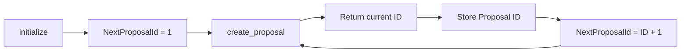

# Governance Proposal ID Convention

> **Implementation walkthrough**
>
> This document explains the proposal ID task implemented in the governance
> contract and the resulting expectations for SDK users, indexers, and
> maintainers.

## At A Glance

| Decision | Result |
| --- | --- |
| ID convention | 1-based |
| First valid proposal ID | `1` |
| Reserved ID | `0` |
| Counter storage | Governance instance storage |
| Proposal storage | Persistent storage, keyed by ID |
| CI configuration | Unchanged |

The existing 1-based behavior was retained to avoid breaking deployed testnet
instances or off-chain consumers that already expect the first proposal to be
ID `1`.

## Why This Needed Clarification

Governance assigns proposal IDs through the `NextProposalId` storage key. A
counter that starts at `1` is valid, but it can cause off-by-one errors when an
off-chain tool assumes IDs begin at `0`.

For example, an indexer that starts scanning at ID `0` will make an unnecessary
query and may incorrectly treat the first proposal as missing. The important
contract behavior is therefore not only the numeric value, but also that the
convention is clearly shared across every integration.

## The Implemented Flow



### 1. Contract initialization

During `governance.initialize(...)`, the contract stores:

```rust
env.storage()
    .instance()
    .set(&DataKey::NextProposalId, &FIRST_PROPOSAL_ID);
```

`FIRST_PROPOSAL_ID` is a shared contract constant with the value `1`. This
makes the convention explicit and avoids repeating an unexplained literal.

### 2. Proposal creation

`create_proposal(...)` reads the current counter, assigns that value to the
new proposal, persists the proposal, and advances the counter:

```text
first proposal:  ID 1, then counter becomes 2
second proposal: ID 2, then counter becomes 3
third proposal:  ID 3, then counter becomes 4
```

The proposal ID remains a `u64`; the task does not change its type or the
proposal lifecycle.

### 3. Proposal lookup and listing

Individual proposals are retrieved with `get_proposal(proposal_id)`. The
on-chain `list_proposals(...)` method scans from the supplied `from_id` and
therefore should be called with `from_id = 1` when scanning from the beginning.

ID `0` is intentionally unused. It is not an alias for the first proposal.

## SDK and Indexer Guidance

The SDK returns the ID produced by the contract. It does not generate a local
counter, so the contract remains the single source of truth.

```typescript
const proposalId = await sdk.governance.createProposal(
  proposerKeypair,
  { vcWeight: 50, txWeight: 25, repaymentWeight: 25 },
  17_280,
  17_280,
);

// Scan from the first valid proposal ID.
const proposals = await sdk.governance.listProposals(1n, 10);
```

Indexers should prefer the `PropCreat` event as the authoritative source for a
created proposal ID. When scanning contract storage directly, begin at `1` and
increment sequentially. Missing IDs should be treated as gaps, not as evidence
that the ID convention starts at `0`.

## Test Coverage

The governance tests verify the sequential starting point:

```rust
assert_eq!(proposal_id_1, 1);
assert_eq!(proposal_id_2, 2);
```

This covers both requirements that matter for integrations:

1. The first proposal receives ID `1`.
2. The counter advances by exactly one for subsequent proposals.

The SDK tests continue to verify that returned contract values are converted to
`bigint` and that proposal listing begins from the caller-provided `fromId`.

## Compatibility Note

Changing an existing deployment from 1-based IDs to 0-based IDs would be a
breaking interface change. It could cause:

- Existing proposal references to resolve to the wrong records.
- Indexers to duplicate or miss historical proposals.
- SDK callers to disagree about the first valid ID.
- Events and stored records to require a migration strategy.

For that reason, this implementation documents and normalizes the current
1-based convention instead of changing live behavior.

## Files Updated

- `contracts/governance/src/lib.rs` - shared first-ID constant, explicit API comments, and sequential-ID assertions.
- `docs/governance.md` - operational convention and migration guidance.
- `packages/sdk/src/index.ts` - SDK API documentation.
- `packages/sdk/README.md` - SDK usage guidance.
- `docs/governance-proposal-id-walkthrough.md` - this implementation walkthrough.

No CI scripts or CI configuration files were changed.

## Testing Performed Before Push

The following checks were run before pushing the branch
`fix/governance-proposal-id-convention`:

| Check | Result | Details |
| --- | --- | --- |
| `cargo test -p governance` | Blocked locally | Rust compilation could not link because `link.exe` from the MSVC toolchain is unavailable. No governance test assertions were executed. |
| `pnpm --filter @stellar-did-credit/sdk test` | Blocked locally | The SDK workspace dependencies are not installed, so Jest was not available. |
| `cargo fmt --package governance -- --check` | Not clean | It reported pre-existing formatting differences in unrelated parts of the governance source file. The formatter was not run in write mode. |
| `cargo fmt --all -- --check` | Not clean | It reported pre-existing formatting differences in unrelated contract files. No unrelated formatting was changed. |
| `git diff --check` | Passed | No whitespace errors were found in the implementation or documentation changes. |
| Editor diagnostics | Passed | No errors were reported for the touched Rust, TypeScript, or Markdown files. |

The focused test commands were attempted without modifying CI scripts or
configuration. The code changes add assertions that the first two proposals
receive IDs `1` and `2`; those assertions remain to be executed in an
environment with the required MSVC linker and installed Node.js dependencies.
