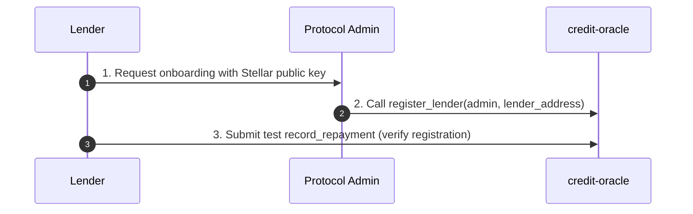

# Lender Integration Guide

This guide shows how DeFi lenders and Stellar anchors integrate credit scoring into their lending platforms, set up their accounts, interpret scores, and report repayment data.

---

## Table of Contents

1. [Prerequisites](#prerequisites)
2. [Lender Registration Flow](#lender-registration-flow)
3. [Interpreting Credit Scores](#interpreting-credit-scores)
4. [Loan Cycle Workflow](#loan-cycle-workflow)
5. [Repayment Reporting & Timing Best Practices](#repayment-reporting--timing-best-practices)
6. [Complete Loan Cycle SDK Example](#complete-loan-cycle-sdk-example)

---

## Prerequisites

To query credit scores and record repayments, you need:

- Node.js 18+
- The `@stellar-did-credit/sdk` and `@stellar/stellar-sdk` packages:
  ```bash
  npm install @stellar-did-credit/sdk @stellar/stellar-sdk
  ```
- A funded Stellar account to sign transactions and pay Soroban fees.

---

## Lender Registration Flow

To prevent malicious actors from inflating credit scores with fake repayment records, the `credit-oracle` contract restricts the `record_repayment` function to authorized lenders.



### 1. Contact the Admin
Provide your organization's Stellar public key (e.g., `G...`) to the protocol administrator. This is the account you will use to sign `record_repayment` transactions.

### 2. Admin Registers the Lender
The administrator will invoke the `register_lender` function on the `credit-oracle` contract:
```rust
pub fn register_lender(env: Env, admin: Address, lender: Address) -> Result<(), CreditOracleError>;
```

### 3. Verify Registration
Once the admin transaction is confirmed, verify your authorization by executing a test `record_repayment` call. If you are not registered, the transaction will fail with `LenderNotRegistered` (Error Code `4`).

---

## Interpreting Credit Scores

The protocol computes credit scores on-chain, returning a value between **300** and **850**. Lenders can use the following score tiers to inform their credit decisions and interest rate pricing:

| Score Range | Risk Tier | Description & Guidance | Recommended Actions |
| :--- | :--- | :--- | :--- |
| **300–450** | **High Risk** | No history or poor repayment history. High probability of default. | Decline loan or require full collateral. |
| **450–600** | **Moderate Risk** | Limited history or occasional late payments. | Approve with lower limits and higher interest rates. |
| **600–700** | **Good** | Stable transaction history and high on-time repayment rate. | Approve standard loan terms and limits. |
| **700–850** | **Excellent** | Multiple verified credentials, high volume, and near-perfect repayment. | Offer maximum limits and prime interest rates. |

> [!NOTE]
> The score is computed dynamically using the on-chain formula. See the [Scoring Specification](scoring-spec.md) for a detailed breakdown of the mathematical formula.

---

## Loan Cycle Workflow

A typical loan cycle with the `stellar-did-credit` protocol follows these steps:

1. **Credit Assessment**: The lender queries the borrower's credit score using the SDK.
2. **Disbursement**: If the score meets the lender's risk tolerance, the lender disburses the funds.
3. **Repayment**: The borrower repays the loan.
4. **Repayment Recording**: The lender immediately records the repayment outcome on-chain.
5. **Score Update**: The borrower's credit score is updated, reflecting the positive (or negative) repayment behavior for future credit checks.

---

## Repayment Reporting & Timing Best Practices

Lenders must report repayment events using the `record_repayment` function on the `credit-oracle` contract.

> [!IMPORTANT]
> **Do not batch repayment reporting.**
> Lenders should call `record_repayment` **immediately** upon receiving a payment. 
> Batching repayments (e.g., once a week or month) delays score updates, preventing borrowers from utilizing their improved credit score elsewhere and skewing the 30-day transaction window metrics. Immediate reporting ensures the on-chain credit score is always fresh and accurate.

---

## Complete Loan Cycle SDK Example

The following TypeScript example demonstrates a complete loan lifecycle. It queries the user's score, simulates a loan disbursement, records the repayment on-chain using the `@stellar/stellar-sdk`, and fetches the updated score.

```typescript
import { StellarDIDCreditSDK } from "@stellar-did-credit/sdk";
import {
  Contract,
  SorobanRpc,
  TransactionBuilder,
  Account,
  Address,
  BASE_FEE,
  nativeToScVal,
  Keypair,
} from "@stellar/stellar-sdk";

// 1. Configuration
const config = {
  identityOracleId: "CDDID...", // Replace with deployed identity-oracle address
  creditOracleId: "CDCREDIT...", // Replace with deployed credit-oracle address
  revocationRegistryId: "CDREV...", // Replace with deployed revocation-registry address
  networkPassphrase: "Test SDF Network ; September 2015",
  rpcUrl: "https://soroban-testnet.stellar.org",
  simAccount: "G...", // A funded account used for read-only simulations
};

// Initialize the SDK
const sdk = new StellarDIDCreditSDK(config);

// The lender's signing keypair (must be registered via register_lender)
const lenderKeypair = Keypair.fromSecret("S..."); 
const subjectAddress = "GDID..."; // The borrower's Stellar address

async function runLoanCycle() {
  const server = new SorobanRpc.Server(config.rpcUrl);
  const creditOracleContract = new Contract(config.creditOracleId);

  // =========================================================================
  // Step 1: Query the borrower's initial credit score
  // =========================================================================
  console.log("Checking borrower credit score...");
  try {
    const initialScore = await sdk.getScore(subjectAddress);
    console.log(`Initial Credit Score: ${initialScore.score}`);
    console.log(`On-Time Repayments: ${initialScore.repaymentRate / 100}%`);
  } catch (error) {
    if (error instanceof Error && error.message.includes("ScoreNotComputedError")) {
      console.log("Borrower has no credit history (Score: 300)");
    } else {
      throw error;
    }
  }

  // =========================================================================
  // Step 2: Disburse the loan (Lender-specific business logic)
  // =========================================================================
  console.log("Disbursing loan to borrower...");
  // [Insert your asset transfer / disbursement logic here]

  // =========================================================================
  // Step 3: Record the repayment (when borrower pays back on time)
  // =========================================================================
  console.log("Recording on-time repayment...");

  // Fetch the lender's current sequence number
  const lenderAccountData = await server.getAccount(lenderKeypair.publicKey());
  const lenderAccount = new Account(lenderKeypair.publicKey(), lenderAccountData.sequence);

  // Build the Soroban transaction calling `record_repayment`
  // fn record_repayment(env: Env, lender: Address, subject: Address, amount: i128, on_time: bool)
  const amount = 100_0000000n; // 100 XLM (expressed in stroops)
  const onTime = true;

  const tx = new TransactionBuilder(lenderAccount, {
    fee: BASE_FEE,
    networkPassphrase: config.networkPassphrase,
  })
    .addOperation(
      creditOracleContract.call(
        "record_repayment",
        new Address(lenderKeypair.publicKey()).toScVal(),
        new Address(subjectAddress).toScVal(),
        nativeToScVal(amount, { type: "i128" }),
        nativeToScVal(onTime),
      )
    )
    .setTimeout(30)
    .build();

  // Simulate the transaction to estimate fees
  const simulation = await server.simulateTransaction(tx);
  if (SorobanRpc.Api.isSimulationError(simulation)) {
    throw new Error(`Simulation failed: ${simulation.error}`);
  }

  // Assemble, sign, and submit the transaction
  const preparedTx = SorobanRpc.Api.assembleTransaction(tx, simulation).build();
  preparedTx.sign(lenderKeypair);

  const response = await server.sendTransaction(preparedTx);
  if (response.status !== "PENDING") {
    throw new Error(`Transaction submission failed: ${response.status}`);
  }

  // Wait for transaction confirmation
  console.log("Waiting for transaction confirmation...");
  let status = "PENDING";
  let txResult;
  while (status === "PENDING") {
    await new Promise((resolve) => setTimeout(resolve, 2000));
    txResult = await server.getTransaction(response.hash);
    status = txResult.status;
  }

  if (status !== "SUCCESS") {
    throw new Error(`Repayment recording failed: ${txResult.status}`);
  }
  console.log("Repayment successfully recorded on-chain!");

  // =========================================================================
  // Step 4: Query the updated credit score
  // =========================================================================
  console.log("Fetching updated credit score...");
  const updatedScore = await sdk.getScore(subjectAddress);
  console.log(`Updated Credit Score: ${updatedScore.score}`);
  console.log(`New On-Time Repayment Rate: ${updatedScore.repaymentRate / 100}%`);
}

runLoanCycle().catch(console.error);
```
