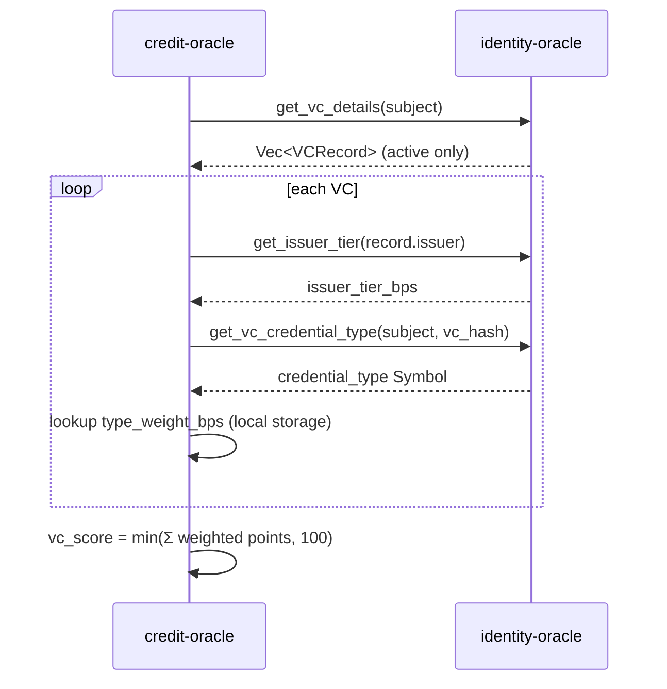

# VC Weighting Design

This document proposes how verifiable credential (VC) metadata — issuer trust, credential type, and issuance recency — can influence the credit score beyond a raw VC count.

## Problem

The legacy formula treats every active VC identically:

```
vc_score = min(vc_count × 20, 100)
```

A regulated KYC credential and a low-assurance self-issued credential contribute the same 20 points. Lenders need issuer trust and credential quality reflected in the score.

## Proposed model

Each **active** VC contributes weighted points. The VC component is the sum of per-credential contributions, capped at 100:

```
vc_score = min( Σ credential_points(vc), 100 )

credential_points(vc) = base_points × issuer_tier_bps × type_weight_bps ÷ 10_000
```

| Parameter | Default | Where configured | Description |
| --------- | ------- | ---------------- | ----------- |
| `base_points` | 20 | credit-oracle (fixed in prototype) | Base contribution per VC before multipliers |
| `issuer_tier_bps` | 100 (1×) | identity-oracle admin via `set_issuer_tier` | Issuer trust multiplier in basis points |
| `type_weight_bps` | 100 (1×) | credit-oracle admin via `set_credential_type_weight` | Credential-type multiplier in basis points |

Basis points use 100 = 1.00×, 200 = 2.00×, 150 = 1.50×.

### Issuer trust (implemented)

Trusted issuers are already registered in identity-oracle. The prototype adds an admin-configurable tier per issuer:

- `set_issuer_tier(admin, issuer, weight_bps)` — e.g. regulated bank at 200 bps (2×)
- `get_issuer_tier(issuer)` — returns 100 bps when unset (backward compatible)

Existing anchored VCs automatically pick up tier changes on the next `compute_score` call.

### Credential type (implemented)

VC anchors remain backward compatible: `anchor_vc` stores records without an explicit type. Untyped VCs default to the `generic` symbol (100 bps unless overridden).

New anchors can call `anchor_vc_typed(issuer, subject, vc_hash, credential_type)` to attach a type label (e.g. `kyc`, `employment`, `email`).

Type weights are configured on credit-oracle:

- `set_credential_type_weight(admin, credential_type, weight_bps)` — e.g. `kyc` at 150 bps
- `get_credential_type_weight(credential_type)` — returns 100 bps when unset

### Recency (design only — not in prototype)

Recency rewards fresh credentials and decays stale ones without deleting anchors:

```
recency_multiplier = max(min_recency_bps, 10_000 − age_days × decay_bps_per_day)
```

Suggested defaults for a future iteration:

| Parameter | Suggested value |
| --------- | --------------- |
| `decay_bps_per_day` | 5 (0.05% per day) |
| `min_recency_bps` | 5000 (50% floor) |
| Full weight window | 0–365 days since `anchored_at` |

Implementation would read `VCRecord.anchored_at` from `get_vc_details` and apply the multiplier inside `compute_score`. No storage migration required.

## Data flow



When identity-oracle is not configured, credit-oracle falls back to the legacy path:

```
vc_score = min(vc_count × 20, 100)
```

## Examples

All examples use `base_points = 20`, default weights 100 bps unless noted.

| VC | Issuer tier | Type | Type weight | Points |
| -- | ----------- | ---- | ----------- | ------ |
| 1× generic | 100 bps | generic | 100 bps | 20 |
| 1× KYC | 200 bps | kyc | 150 bps | 60 |
| 2× generic (tier-1 issuer) | 100 bps | generic | 100 bps | 40 |

Three tier-1 generic VCs → `vc_score = 60` (legacy-equivalent for uniform credentials).

One tier-2 KYC VC → `vc_score = 60`, matching three generic VCs — reflecting higher assurance.

## Backward compatibility

| Scenario | Behavior |
| -------- | -------- |
| Existing `anchor_vc` records | Treated as `generic` type, issuer tier 100 bps |
| No identity-oracle link on credit-oracle | Legacy `vc_count × 20` via cached feeder count |
| Issuer tier unset | Defaults to 100 bps (same as legacy per-VC value) |
| Type weight unset | Defaults to 100 bps |

## Future work (out of scope for #243)

- Recency decay using `anchored_at`
- Standardized credential schema (SEP) validation
- Real-time off-chain verification callbacks
- Storing `credential_type` inline on `VCRecord` after a migration window
