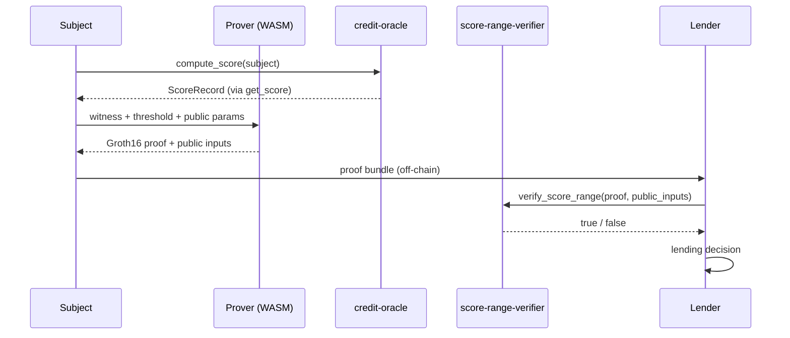

# ZK Proof Layer Design (Phase 4)

This document defines the zero-knowledge proof layer for **selective score disclosure** in stellar-did-credit. Phase 4 lets a subject prove statements such as "my credit score is above 650" to a lender without revealing the exact score, underlying VC count, transaction volume, or repayment rate.

**Status:** Research / design — no circuit or verifier contract is implemented yet. This document is the starting point for Phase 4 contributors.

**Related specs:** [Scoring Specification](scoring-spec.md) · [Architecture Overview](architecture.md)

---

## Goals and non-goals

### Goals

- Prove **range statements** on the credit score (e.g. `score > threshold`, `score ∈ [600, 700]`).
- Bind proofs to a **specific subject address** and to a **specific credit-oracle state** so they cannot be replayed across users or stale ledger snapshots.
- Verify proofs **on-chain** via a dedicated Soroban verifier contract that returns `bool`.
- Keep the prover **WASM-friendly** so proof generation can run in browsers, mobile wallets, or server-side workers.

### Non-goals (Phase 4 v1)

- Hiding the subject's Stellar address from the verifier (the lender knows who is applying).
- Proving properties of individual VCs or off-chain credential contents (only the aggregated score path).
- Replacing `get_score` — the ZK layer is additive; permissionless score reads remain available unless the subject opts into a privacy-preserving flow.

---

## Proof statement

The primary statement Phase 4 targets:

> **Statement S(threshold, subject, snapshot):**
> I know a witness `w` such that:
>
> 1. `score = f(w)` where `f` is the deterministic scoring function defined in [scoring-spec.md](scoring-spec.md).
> 2. `score > threshold` (generalized to range proofs below).
> 3. `score` was computed from on-chain inputs that match the **credit-oracle snapshot** identified by public inputs `(credit_oracle_id, subject, score_commitment_root)`.
> 4. The witness `w` includes the private fields of a valid `ScoreRecord` and the raw scoring inputs used at computation time.

### Formal witness and public inputs

**Private witness (prover-only):**

| Field | Type | Role |
| ----- | ---- | ---- |
| `score` | `u32` | Final credit score (300–850) |
| `vc_count` | `u32` | VC count at computation |
| `tx_volume_30d` | `i128` | 30-day volume in stroops |
| `repayment_rate` | `u32` | Basis points (0–10000) |
| `last_updated` | `u64` | Ledger timestamp of computation |
| `vc_weight`, `tx_weight`, `repayment_weight` | `u32` | Weights active at computation |
| `vc_score`, `tx_score`, `repay_score`, `counterparty_bonus` | `u32` | Intermediate component scores |
| `composite` | `u32` | Weighted composite before final mapping |
| `blinding` | field element | Commitment randomness |

**Public inputs (verifier-visible):**

| Field | Type | Role |
| ----- | ---- | ---- |
| `threshold` | `u32` | Minimum score the prover claims |
| `subject` | `Address` | Stellar account whose score is attested |
| `credit_oracle_id` | `Address` | Contract whose state is referenced |
| `score_commitment` | `BytesN<32>` | Commitment to the private `ScoreRecord` |
| `weights_commitment` | `BytesN<32>` | Commitment to active `ScoringWeights` (or hash of public weights) |
| `snapshot_ledger` | `u32` | Ledger sequence when inputs were valid |
| `domain_separator` | `BytesN<32>` | Protocol/version binding (anti cross-protocol replay) |

The circuit enforces:

```
score > threshold
score == clamp(MIN_SCORE + composite * 550 / 100, MIN_SCORE, MAX_SCORE)
composite == (vc_score * vc_w + (tx_score + counterparty_bonus) * tx_w + repay_score * repay_w) / 100
vc_score == min(vc_count * 20, 100)
tx_score == min(tx_volume_30d / 100_000_000, 100)   // integer division
repay_score == repayment_rate / 100
score_commitment == Commit(score, vc_count, tx_volume_30d, repayment_rate, last_updated, blinding)
```

The on-chain verifier checks the SNARK **and** that public inputs match the invocation arguments. Binding `subject` and `credit_oracle_id` into the Fiat–Shamir transcript prevents proof reuse across accounts or deployments.

### Extended statements (future)

| Statement | Example use case |
| --------- | ---------------- |
| Range | `600 ≤ score ≤ 700` for tiered loan products |
| Equality | `score == 712` for audit disputes (subject opts in) |
| Component bound | `repayment_rate ≥ 8000` without revealing score |
| Freshness | `last_updated ≥ T` combined with score range |

---

## Threat model

### Assets

- **Score privacy:** exact score and decomposed inputs (`vc_count`, `tx_volume_30d`, `repayment_rate`).
- **Proof integrity:** lenders must not accept forged or replayed proofs.
- **Protocol reputation:** bogus proofs must not bypass lending policy.

### Actors

| Actor | Capability |
| ----- | ---------- |
| Subject (prover) | Knows full witness; wants to prove only a predicate |
| Lender (verifier) | Sees public inputs + proof; must accept valid statements only |
| Adversary | May replay proofs, tamper with public inputs, or submit proofs for others' scores |
| Feeder / lender (protocol) | Controls on-chain inputs; assumed honest for scoring inputs already stored |

### Threats and mitigations

| Threat | Impact | Mitigation |
| ------ | ------ | ---------- |
| **Proof replay** | Adversary re-submits a valid proof in a different context | Bind `domain_separator`, `subject`, `credit_oracle_id`, and optional nonce/challenge in public inputs; lender stores consumed proof hashes |
| **Stale snapshot** | Subject proves an old high score after score drops | Require `snapshot_ledger` or `last_updated` in public inputs; lender policy rejects proofs older than N ledgers |
| **Wrong subject** | Proof for Alice used by Bob | `subject` is a public input hashed into the circuit |
| **Score inflation in circuit** | Prover fakes `score` without valid inputs | Circuit re-implements `f` from [scoring-spec.md](scoring-spec.md); commitment opens to consistent witness |
| **On-chain / off-chain drift** | Circuit formula differs from deployed `compute_score` | Version `domain_separator` per scoring-spec revision; integration tests against contract snapshots |
| **Trusted setup compromise** (Groth16) | Forged proofs for that circuit | Use audited ceremony; document circuit hash in verifier; consider PLONK for updatable SRS |
| **Verifier DoS** | Large proofs exhaust Soroban budget | Fixed proof size (Groth16); gas benchmarks before mainnet; reject malformed lengths early |

### Trust assumptions

1. The **credit-oracle contract** correctly stores inputs used by feeders and lenders (existing protocol assumption).
2. The **verifier contract** embeds the correct verification key for the deployed circuit version.
3. The **prover** obtains witness data honestly (typically by reading their own on-chain `ScoreRecord` and inputs after calling `compute_score`).
4. Phase 4 v1 does **not** prove that `compute_score` was called on-chain — only that the witness is consistent with the public scoring formula. Optional Phase 4b can add a Merkle inclusion proof against on-chain storage.

---

## Commitment scheme for `ScoreRecord`

A hiding commitment lets the prover demonstrate range relations on `score` without revealing other fields.

### Recommended: Pedersen-style vector commitment (BN254 field)

Map each `ScoreRecord` field to a field element and commit:

```
C = score·G_score + vc_count·G_vc + tx_vol·G_tx + repay_rate·G_repay
  + last_updated·G_ts + blinding·H
```

- **Hiding:** `blinding` prevents recovery of individual fields from `C`.
- **Binding:** discrete-log assumption on the chosen curve.
- **Range proofs:** decompose `score - threshold` into bits and prove each bit ∈ {0,1} (or use Bulletproofs-style inner-product argument inside the SNARK).

**On Stellar today:** BN254 arithmetic is proposed in [CAP-0074](https://github.com/stellar/stellar-protocol/blob/master/core/cap-0074.md) (not yet production-default). Phase 4 development should target BN254 inside the circuit while the Soroban verifier uses **Groth16 on BLS12-381** ([CAP-0059](https://github.com/stellar/stellar-protocol/blob/master/core/cap-0059.md), available) with public inputs that include the commitment hash.

### Alternative: Poseidon hash commitment

If [CAP-0075](https://github.com/stellar/stellar-protocol/blob/master/core/cap-0075.md) (Poseidon) is available on the target network:

```
commitment = Poseidon(score, vc_count, tx_volume_30d, repayment_rate, last_updated, blinding)
```

Poseidon is SNARK-friendly (few constraints) and aligns with future Stellar host functions. The circuit proves knowledge of preimage and the score relation simultaneously.

### Alternative: Merkle leaf commitment

For Phase 4b **on-chain state binding**, store `H(ScoreRecord)` as a leaf in a sparse Merkle tree keyed by `subject`. The circuit proves:

1. Merkle inclusion of leaf under `score_commitment_root` published by credit-oracle or a registry contract.
2. Range relation on the opened `score`.

This adds a contract change but removes the need to trust off-chain witness sourcing.

### Field encoding notes

| Rust / Soroban type | Circuit encoding |
| ------------------- | ---------------- |
| `u32` | 32-bit integer in BN254 scalar field |
| `i128` (`tx_volume_30d`) | Split into two `u64` limbs or range-check to protocol max |
| `Address` | 32-byte public key hash as field element(s) |
| `u64` (`last_updated`) | 64-bit integer |

All arithmetic in the circuit must use **integer division semantics** matching the contract (see [scoring-spec.md](scoring-spec.md)).

---

## Proving systems compatible with WASM

Phase 4 provers run off-chain in browsers or Node.js. On-chain verification runs in Soroban. The table below compares candidate stacks.

| System | Prover (WASM) | Verifier on Soroban | Proof size | Setup | Maturity on Stellar |
| ------ | ------------- | ------------------- | ---------- | ----- | ------------------- |
| **Groth16** (arkworks / circom-snarkjs) | ✅ arkworks-rs, snarkjs | ✅ [CAP-0059 BLS12-381 host fn](https://github.com/stellar/stellar-protocol/blob/master/core/cap-0059.md); [soroban-examples/groth16_verifier](https://github.com/stellar/soroban-examples/tree/main/groth16_verifier) | ~192 bytes | Per-circuit trusted setup | **Best fit today** |
| **PLONK** (halo2) | ✅ halo2 WASM builds | ⚠️ No native PLONK host fn; verify in contract bytecode or wrap Groth16 wrapper | ~1–2 KB | Universal SRS (updatable) | Research path — prover OK, verifier costly |
| **SP1 zkVM** (RISC Zero) | ✅ x86/RISC-V → STARK → Groth16 wrap | ✅ If wrapped to Groth16/BLS12-381 | Variable | Shared STARK setup + Groth16 layer | Good for **rapid prototyping** — prove Rust scoring code verbatim, wrap for chain |
| **Noir** | ✅ `@noir-lang/noir_js` | ⚠️ Export to Groth16 backend for Soroban | Depends on backend | Backend-dependent | Ergonomic DSL; still needs Groth16 export for Stellar |
| **Bulletproofs** | ✅ dalek-cryptography | ❌ Too expensive to verify on-chain for full range proofs | ~600+ bytes | Transparent | Better for single-value range proofs off-chain; not recommended as primary on-chain verifier |

### Recommendation

**Primary path:** Author the circuit in **Circom** or **arkworks** (Rust), generate Groth16 proofs with WASM-capable tooling, verify with a thin Soroban wrapper around Stellar's BLS12-381 pairing host functions.

**Prototyping path:** Re-implement `compute_score` in SP1 or RISC Zero guest, prove execution correctness, compress to Groth16 for deployment. Useful to validate the scoring logic before optimizing constraint count.

**Defer:** Pure halo2 on-chain verification until PLONK/BN254 verifier primitives are standardized on Soroban or until budget benchmarks show inline verification is affordable.

---

## Architecture



### Component split (policy-and-proof pattern)

| Component | Responsibility |
| --------- | -------------- |
| `score-range-verifier` (new Soroban contract) | Cryptographic verification only; returns `bool` |
| `credit-oracle` (existing) | Source of truth for scores; unchanged in Phase 4 v1 |
| Prover SDK (new TS/Rust crate) | Witness collection, proof generation, serialization |
| Lender SDK | Calls verifier, enforces freshness policy, tracks replay nonces |

---

## Soroban verifier contract sketch

The following is a **design sketch**, not deployed code. It follows the [soroban-examples Groth16 verifier](https://github.com/stellar/soroban-examples/tree/main/groth16_verifier) pattern.

```rust
#![no_std]
use soroban_sdk::{contract, contractimpl, contracttype, Address, Bytes, BytesN, Env};

/// Fixed-size Groth16 proof encoding (BLS12-381): 192 bytes
pub const PROOF_SIZE: u32 = 192;

/// Public inputs hashed into the verification key domain.
#[contracttype]
#[derive(Clone)]
pub struct ScoreRangePublicInputs {
    pub threshold: u32,
    pub subject: Address,
    pub credit_oracle_id: Address,
    pub score_commitment: BytesN<32>,
    pub snapshot_ledger: u32,
    pub domain_separator: BytesN<32>,
}

#[contract]
pub struct ScoreRangeVerifier;

#[contractimpl]
impl ScoreRangeVerifier {
    /// One-time setup: store verification key hash and circuit version.
    pub fn initialize(env: Env, admin: Address, vk_hash: BytesN<32>, circuit_version: u32) {
        // Store admin + vk_hash in instance storage
    }

    /// Verify a Groth16 proof that the committed score exceeds `threshold`.
    ///
    /// Returns `true` iff the proof is valid for the supplied public inputs.
    /// Does not mutate state — lenders may simulate read-only.
    pub fn verify_score_range(
        env: Env,
        proof: Bytes,                       // length must == PROOF_SIZE
        public_inputs: ScoreRangePublicInputs,
    ) -> bool {
        // 1. Assert proof.len() == PROOF_SIZE
        // 2. Load stored vk_hash; reject if circuit_version mismatch
        // 3. Map public_inputs to field elements (canonical encoding)
        // 4. Call BLS12-381 pairing host functions (CAP-0059)
        // 5. Return pairing check result
        true // placeholder
    }

    /// Optional: stateful verify with replay protection.
    pub fn verify_and_consume(
        env: Env,
        consumer: Address,
        proof: Bytes,
        public_inputs: ScoreRangePublicInputs,
        nonce: BytesN<32>,
    ) -> bool {
        // consumer.require_auth();
        // proof_hash = SHA256(proof || public_inputs || nonce)
        // panic if proof_hash already in Persistent storage
        // else run verify_score_range, store proof_hash on success
        true // placeholder
    }
}
```

### Integration notes

- Embed the **verification key** at compile time or load from storage; store only `vk_hash` on-chain for upgrade auditability.
- Expose a **`circuit_version`** constant matching `domain_separator` in the circuit artifact.
- Lenders should **simulate** `verify_score_range` before accepting off-chain proof bundles.
- Benchmark proof verification against Soroban **resource limits** on testnet before mainnet deployment.

---

## Off-chain prover workflow

1. Subject (or wallet) calls `compute_score` on credit-oracle.
2. Prover reads `get_score(subject)` plus raw `TxStats`, `RepaymentRecord`, and active weights.
3. Prover constructs witness vector and public inputs for the chosen `threshold`.
4. WASM prover (snarkjs or arkworks-wasm) generates Groth16 proof.
5. Subject sends `{ proof, public_inputs, circuit_version }` to lender via API or QR.
6. Lender simulates `verify_score_range` on Stellar RPC.

### Proof bundle serialization (JSON)

```json
{
  "circuit_version": 1,
  "proof": "<base64 192 bytes>",
  "public_inputs": {
    "threshold": 650,
    "subject": "G...",
    "credit_oracle_id": "C...",
    "score_commitment": "<hex 32 bytes>",
    "snapshot_ledger": 1234567,
    "domain_separator": "<hex 32 bytes>"
  }
}
```

---

## Open research questions

1. **On-chain vs off-chain witness:** Is proving formula consistency sufficient for lenders, or is a Merkle proof against `Score(Address)` storage required?
2. **Weight changes:** When admin applies new weights via timelock, must the circuit include weight commitments or read weights as public inputs?
3. **Constraint budget:** What is the minimum constraint count for the full scoring formula with 32-bit range proofs on `score`?
4. **i128 volume encoding:** Best practice for `tx_volume_30d` range checks without blowing up constraints?
5. **Cross-contract VC count:** Once credit-oracle reads identity-oracle directly, should the witness include a cross-contract call proof or only the resolved `vc_count`?
6. **Proof delegation:** Can a subject delegate proof generation to a mobile wallet without exporting raw score data to a third-party server?
7. **Selective component disclosure:** Do lenders need component-level predicates (`repay_score > 80`) in v1 or only full-score range?
8. **Ceremony operations:** Who runs the Groth16 trusted setup, and how is the resulting `vk_hash` governance-approved?
9. **CAP-0074/0075 timeline:** Should Phase 4 wait for BN254/Poseidon host functions to simplify commitments inside the circuit?
10. **Revocation interaction:** If a VC is revoked after proof generation, should lender policy re-check `is_verified` separately?

---

## Library and tooling options

| Library / tool | Language | Use in Phase 4 | Notes |
| -------------- | -------- | -------------- | ----- |
| [ark-groth16](https://github.com/arkworks-rs/groth16) | Rust | Circuit + prover + vk generation | Native Rust; WASM via `wasm-pack` |
| [circom + snarkjs](https://github.com/iden3/snarkjs) | Circom / JS | Circuit authoring; browser prover | Mature ecosystem; export vk for Soroban |
| [halo2](https://github.com/privacy-scaling-explorations/halo2) | Rust | PLONK prover (WASM) | Defer on-chain PLONK verify |
| [SP1 / RISC Zero](https://github.com/succinctlabs/sp1) | Rust | zkVM prototype of scoring | Wrap STARK proof to Groth16 for chain |
| [Noir](https://noir-lang.org/) | Noir | DSL for predicates | Compile to Groth16 backend for Stellar |
| [soroban-sdk BLS12-381](https://developers.stellar.org/docs/build/guides/conversions/address-auth) | Rust | Verifier contract | Check SDK version for host fn support |
| [stellar/soroban-examples/groth16_verifier](https://github.com/stellar/soroban-examples/tree/main/groth16_verifier) | Rust | Reference verifier | Starting point for `score-range-verifier` |

---

## Implementation roadmap (suggested)

| Step | Deliverable | Depends on |
| ---- | ----------- | ---------- |
| 1 | Constraint count estimate for score > T circuit | This document |
| 2 | Circom/arkworks circuit + unit tests against scoring-spec vectors | Step 1 |
| 3 | Groth16 ceremony + vk hash | Step 2 |
| 4 | `score-range-verifier` Soroban contract + tests | Step 3, CAP-0059 |
| 5 | TypeScript prover module in SDK | Step 2 |
| 6 | End-to-end integration test (testnet) | Steps 4–5 |
| 7 | Optional Merkle binding to on-chain `ScoreRecord` | Research Q1 |

---

## References

- [Scoring Specification](scoring-spec.md) — canonical formula
- [Architecture Overview](architecture.md) — contract roles
- [CAP-0059 — BLS12-381 on Soroban](https://github.com/stellar/stellar-protocol/blob/master/core/cap-0059.md)
- [CAP-0074 — BN254 elliptic curve](https://github.com/stellar/stellar-protocol/blob/master/core/cap-0074.md)
- [CAP-0075 — Poseidon hash](https://github.com/stellar/stellar-protocol/blob/master/core/cap-0075.md)
- [Stellar Soroban Groth16 verifier example](https://github.com/stellar/soroban-examples/tree/main/groth16_verifier)
- [Stellar software versions](https://developers.stellar.org/docs/networks/software-versions)
